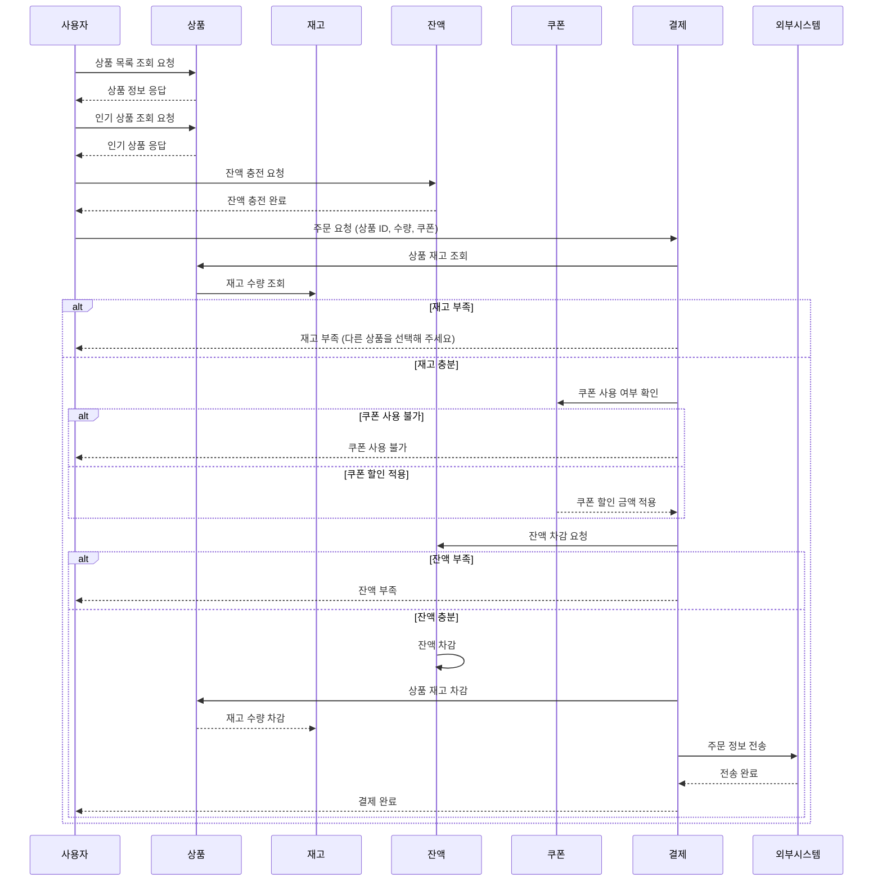

#  🔍️ E-commerce 서비스 시퀀스 다이어그램

## 1. 기능 전체

 펼치기 

 

---

 

## 2. 기능별 상세

### ✅ 상품 조회

 펼치기 

> ※ 초기 시퀀스 다이어그램은 RDB 기반으로 작성합니다.  
> 추후 성능 최적화 시 별도 **캐시 저장소(ex. Redis)** 를 통해 관리하는 구조로 확장합니다.
 

 

---

### ✅ 인기 상품 조회

 펼치기 

> ※ 초기 시퀀스 다이어그램은 RDB 기반으로 작성합니다.  
> 추후 성능 최적화 시 별도 **캐시 저장소(ex. Redis)** 를 통해 관리하는 구조로 확장합니다.

 

---

### ✅ 잔액 충전

 펼치기 

 

---

### ✅ 잔액 조회

 펼치기 

 

---

### ✅ 쿠폰 발급

 펼치기 

> ※ 현재는 RDB 기반으로 작성됩니다.  
> 추후 성능 최적화 시, 쿠폰 발급 및 조회는 **Redis**를 사용하여 실시간 처리합니다.  
> RDB는 전체 쿠폰 수량 관리 및 일관성 유지에 사용되며,  
> Redis는 **실시간 발급**과 **조회**를 빠르게 처리합니다.

 

---

### ✅ 쿠폰 조회

 펼치기 

 

---

### ✅ 쿠폰 사용

 펼치기 

 

---

### ✅ 주문

 펼치기 

 

---

### ✅ 결제

 펼치기 

 
