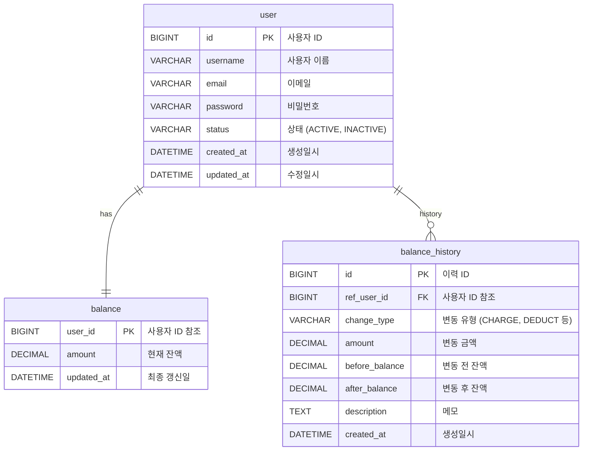
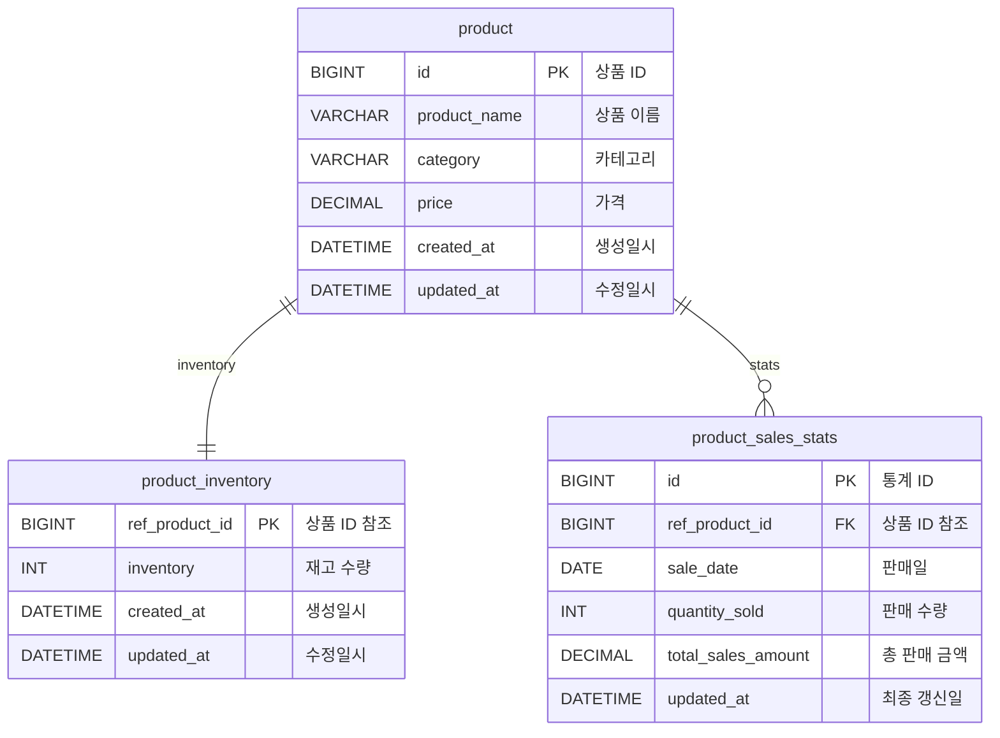
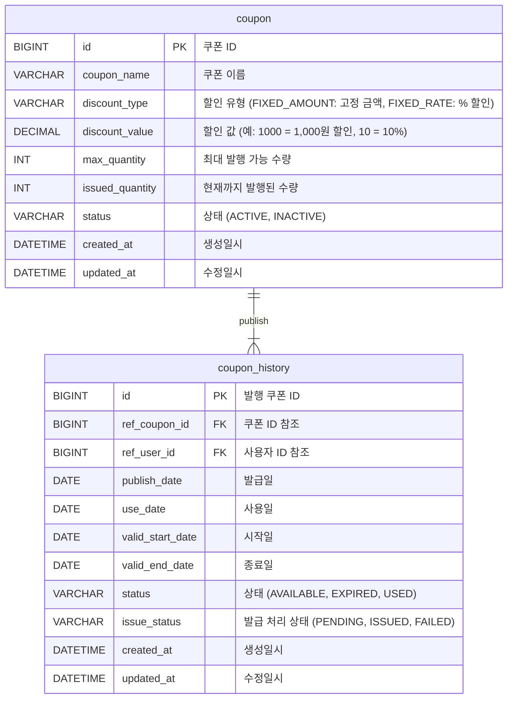
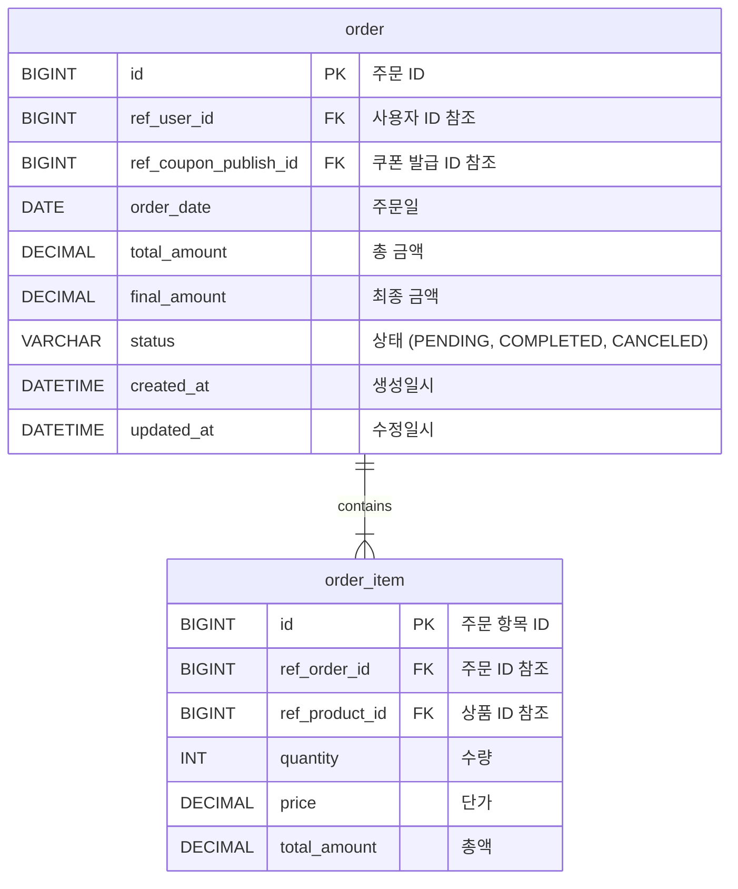
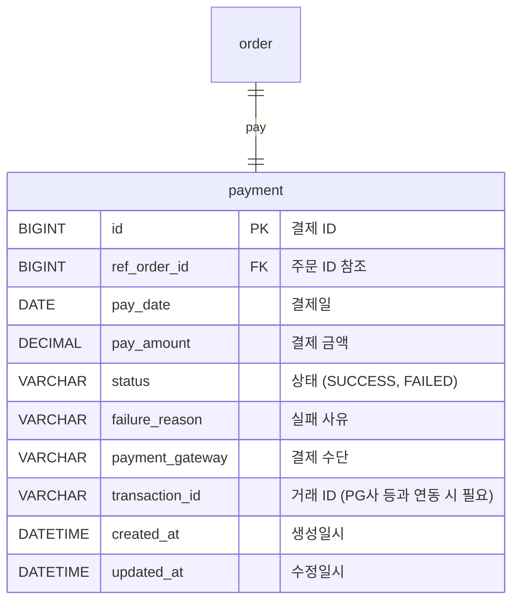

# 📚 E-commerce 서비스 ERD

## 전체 ERD

```mermaid
erDiagram
    user {
        BIGINT id PK "사용자 ID"
        VARCHAR username "사용자 이름"
        VARCHAR email "이메일"
        VARCHAR password "비밀번호"
        VARCHAR status "상태 (ACTIVE, INACTIVE)"
        DATETIME created_at "생성일시"
        DATETIME updated_at "수정일시"
    }

    balance {
        BIGINT user_id PK "사용자 ID 참조"
        DECIMAL amount "현재 잔액"
        DATETIME updated_at "최종 갱신일"
    }

    balance_history {
        BIGINT id PK "이력 ID"
        BIGINT ref_user_id FK "사용자 ID 참조"
        VARCHAR change_type "변동 유형 (CHARGE, DEDUCT 등)"
        DECIMAL amount "변동 금액"
        DECIMAL before_balance "변동 전 잔액"
        DECIMAL after_balance "변동 후 잔액"
        TEXT description "메모"
        DATETIME created_at "생성일시"
    }

    product {
        BIGINT id PK "상품 ID"
        VARCHAR product_name "상품 이름"
        VARCHAR category "카테고리"
        DECIMAL price "가격"
        DATETIME created_at "생성일시"
        DATETIME updated_at "수정일시"
    }

    product_inventory {
        BIGINT ref_product_id PK "상품 ID 참조"
        INT inventory "재고 수량"
        DATETIME created_at "생성일시"
        DATETIME updated_at "수정일시"
    }

    product_sales_stats {
        BIGINT id PK "통계 ID"
        BIGINT ref_product_id FK "상품 ID 참조"
        DATE sale_date "판매일"
        INT quantity_sold "판매 수량"
        DECIMAL total_sales_amount "총 판매 금액"
        DATETIME updated_at "최종 갱신일"
    }

    coupon {
        BIGINT id PK "쿠폰 ID"
        VARCHAR coupon_name "쿠폰 이름"
        VARCHAR discount_type "할인 유형 (FIXED_AMOUNT: 고정 금액, FIXED_RATE: % 할인)"
        DECIMAL discount_value "할인 값 (예: 1000 = 1,000원 할인, 10 = 10%)"
        INT max_quantity "최대 발행 가능 수량"
        INT issued_quantity "현재까지 발행된 수량"
        VARCHAR status "상태 (ACTIVE, INACTIVE)"
        DATETIME created_at "생성일시"
        DATETIME updated_at "수정일시"
    }

    coupon_history {
        BIGINT id PK "발행 쿠폰 ID"
        BIGINT ref_coupon_id FK "쿠폰 ID 참조"
        BIGINT ref_user_id FK "사용자 ID 참조"
        DATE publish_date "발급일"
        DATE use_date "사용일"
        DATE valid_start_date "시작일"
        DATE valid_end_date "종료일"
        VARCHAR status "상태 (AVAILABLE, EXPIRED, USED)"
        VARCHAR issue_status "발급 처리 상태 (PENDING, ISSUED, FAILED)"
        DATETIME created_at "생성일시"
        DATETIME updated_at "수정일시"
    }

    order {
        BIGINT id PK "주문 ID"
        BIGINT ref_user_id FK "사용자 ID 참조"
        BIGINT ref_coupon_publish_id FK "쿠폰 발급 ID 참조"
        DATE order_date "주문일"
        DECIMAL total_amount "총 금액"
        DECIMAL final_amount "최종 금액"
        VARCHAR status "상태 (PENDING, COMPLETED, CANCELED)"
        DATETIME created_at "생성일시"
        DATETIME updated_at "수정일시"
    }

    order_item {
        BIGINT id PK "주문 항목 ID"
        BIGINT ref_order_id FK "주문 ID 참조"
        BIGINT ref_product_id FK "상품 ID 참조"
        INT quantity "수량"
        DECIMAL price "단가"
        DECIMAL total_amount "총액"
    }

    payment {
        BIGINT id PK "결제 ID"
        BIGINT ref_order_id FK "주문 ID 참조"
        DATE pay_date "결제일"
        DECIMAL pay_amount "결제 금액"
        VARCHAR status "상태 (SUCCESS, FAILED)"
        VARCHAR failure_reason "실패 사유"
        VARCHAR payment_gateway "결제 수단"
        VARCHAR transaction_id "거래 ID (PG사 등과 연동 시 필요)"
        DATETIME created_at "생성일시"
        DATETIME updated_at "수정일시"
    }

    user ||--|| balance : has
    user ||--o{ balance_history : history
    user ||--o{ coupon_history : has
    coupon ||--|{ coupon_history : publish
    user ||--|{ order : order
    order ||--|{ order_item : contains
    order ||--|| coupon_history : use
    product ||--|{ order_item : is
    order ||--|| payment : pay
    product ||--|| product_inventory : inventory
    product ||--o{ product_sales_stats : stats

```

---

  

---

## ✅  사용자 관련 테이블

```mermaid
erDiagram
    user {
        BIGINT id PK "사용자 ID"
        VARCHAR username "사용자 이름"
        VARCHAR email "이메일"
        VARCHAR password "비밀번호"
        VARCHAR status "상태 (ACTIVE, INACTIVE)"
        DATETIME created_at "생성일시"
        DATETIME updated_at "수정일시"
    }

    balance {
        BIGINT user_id PK "사용자 ID 참조"
        DECIMAL amount "현재 잔액"
        DATETIME updated_at "최종 갱신일"
    }

    balance_history {
        BIGINT id PK "이력 ID"
        BIGINT ref_user_id FK "사용자 ID 참조"
        VARCHAR change_type "변동 유형 (CHARGE, DEDUCT 등)"
        DECIMAL amount "변동 금액"
        DECIMAL before_balance "변동 전 잔액"
        DECIMAL after_balance "변동 후 잔액"
        TEXT description "메모"
        DATETIME created_at "생성일시"
    }

    user ||--|| balance : has
    user ||--o{ balance_history : history

```

---

## ✅ 상품 관련 테이블

```mermaid
erDiagram
    product {
        BIGINT id PK "상품 ID"
        VARCHAR product_name "상품 이름"
        VARCHAR category "카테고리"
        DECIMAL price "가격"
        DATETIME created_at "생성일시"
        DATETIME updated_at "수정일시"
    }

    product_inventory {
        BIGINT ref_product_id PK "상품 ID 참조"
        INT inventory "재고 수량"
        DATETIME created_at "생성일시"
        DATETIME updated_at "수정일시"
    }

    product_sales_stats {
        BIGINT id PK "통계 ID"
        BIGINT ref_product_id FK "상품 ID 참조"
        DATE sale_date "판매일"
        INT quantity_sold "판매 수량"
        DECIMAL total_sales_amount "총 판매 금액"
        DATETIME updated_at "최종 갱신일"
    }

    product ||--|| product_inventory : inventory
    product ||--o{ product_sales_stats : stats

```

---

## ✅ 쿠폰 관련 테이블

```mermaid
erDiagram
    coupon {
        BIGINT id PK "쿠폰 ID"
        VARCHAR coupon_name "쿠폰 이름"
        VARCHAR discount_type "할인 유형 (FIXED_AMOUNT: 고정 금액, FIXED_RATE: % 할인)"
        DECIMAL discount_value "할인 값 (예: 1000 = 1,000원 할인, 10 = 10%)"
        INT max_quantity "최대 발행 가능 수량"
        INT issued_quantity "현재까지 발행된 수량"
        VARCHAR status "상태 (ACTIVE, INACTIVE)"
        DATETIME created_at "생성일시"
        DATETIME updated_at "수정일시"
    }

    coupon_history {
        BIGINT id PK "발행 쿠폰 ID"
        BIGINT ref_coupon_id FK "쿠폰 ID 참조"
        BIGINT ref_user_id FK "사용자 ID 참조"
        DATE publish_date "발급일"
        DATE use_date "사용일"
        DATE valid_start_date "시작일"
        DATE valid_end_date "종료일"
        VARCHAR status "상태 (AVAILABLE, EXPIRED, USED)"
        VARCHAR issue_status "발급 처리 상태 (PENDING, ISSUED, FAILED)"
        DATETIME created_at "생성일시"
        DATETIME updated_at "수정일시"
    }

    coupon ||--|{ coupon_history : publish

```

---

## ✅ 주문 관련 테이블

```mermaid
erDiagram
    order {
        BIGINT id PK "주문 ID"
        BIGINT ref_user_id FK "사용자 ID 참조"
        BIGINT ref_coupon_publish_id FK "쿠폰 발급 ID 참조"
        DATE order_date "주문일"
        DECIMAL total_amount "총 금액"
        DECIMAL final_amount "최종 금액"
        VARCHAR status "상태 (PENDING, COMPLETED, CANCELED)"
        DATETIME created_at "생성일시"
        DATETIME updated_at "수정일시"
    }

    order_item {
        BIGINT id PK "주문 항목 ID"
        BIGINT ref_order_id FK "주문 ID 참조"
        BIGINT ref_product_id FK "상품 ID 참조"
        INT quantity "수량"
        DECIMAL price "단가"
        DECIMAL total_amount "총액"
    }

    order ||--|{ order_item : contains

```

---

## ✅ 결제 관련 테이블

```mermaid
erDiagram
    payment {
        BIGINT id PK "결제 ID"
        BIGINT ref_order_id FK "주문 ID 참조"
        DATE pay_date "결제일"
        DECIMAL pay_amount "결제 금액"
        VARCHAR status "상태 (SUCCESS, FAILED)"
        VARCHAR failure_reason "실패 사유"
        VARCHAR payment_gateway "결제 수단"
        VARCHAR transaction_id "거래 ID (PG사 등과 연동 시 필요)"
        DATETIME created_at "생성일시"
        DATETIME updated_at "수정일시"
    }

    order ||--|| payment : pay

```
