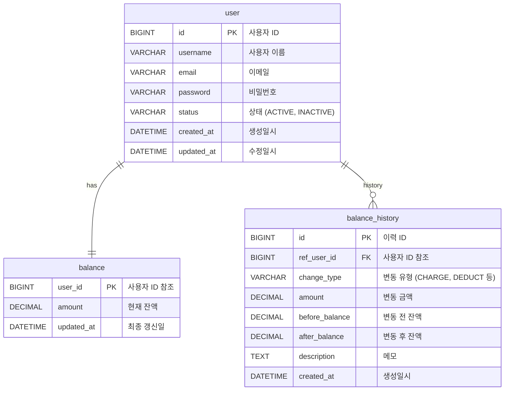
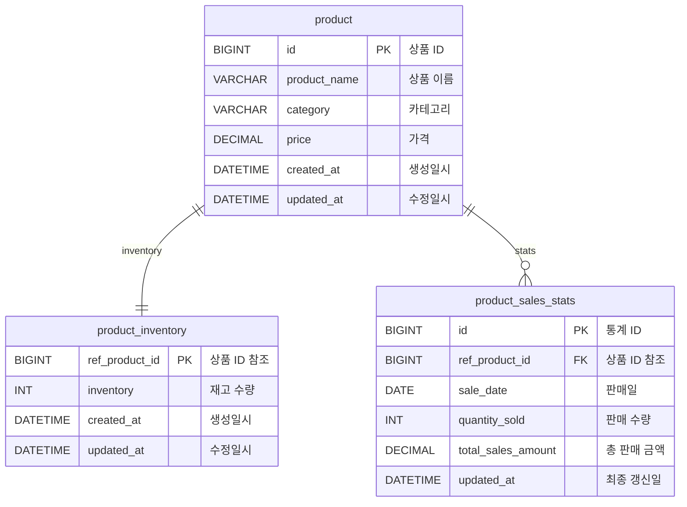
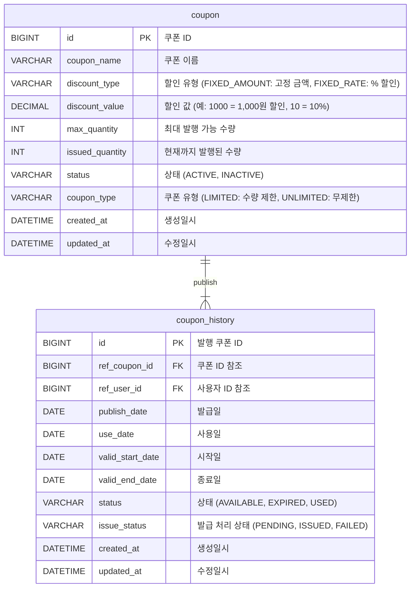
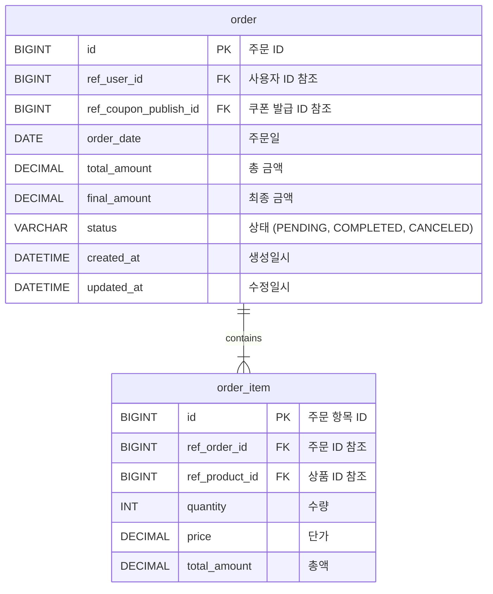
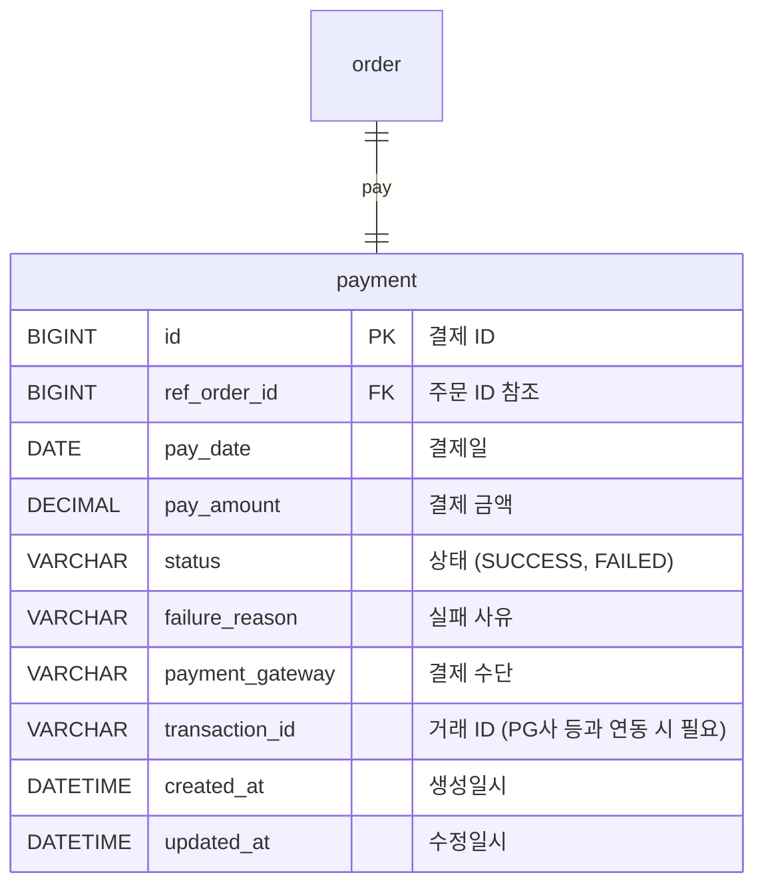

# 📚 E-commerce 서비스 ERD

## 전체 ERD

```mermaid
erDiagram
    user {
        BIGINT id PK "사용자 ID"
        VARCHAR username "사용자 이름"
        VARCHAR email "이메일"
        VARCHAR password "비밀번호"
        VARCHAR status "상태 (ACTIVE, INACTIVE)"
        DATETIME created_at "생성일시"
        DATETIME updated_at "수정일시"
    }

    balance {
        BIGINT user_id PK "사용자 ID 참조"
        DECIMAL amount "현재 잔액"
        DATETIME updated_at "최종 갱신일"
    }

    balance_history {
        BIGINT id PK "이력 ID"
        BIGINT ref_user_id FK "사용자 ID 참조"
        VARCHAR change_type "변동 유형 (CHARGE, DEDUCT 등)"
        DECIMAL amount "변동 금액"
        DECIMAL before_balance "변동 전 잔액"
        DECIMAL after_balance "변동 후 잔액"
        TEXT description "메모"
        DATETIME created_at "생성일시"
        DATETIME updated_at "수정일시"
    }

    product {
        BIGINT id PK "상품 ID"
        VARCHAR product_name "상품 이름"
        VARCHAR category "카테고리"
        DECIMAL price "가격"
        DATETIME created_at "생성일시"
        DATETIME updated_at "수정일시"
    }

    product_inventory {
        BIGINT ref_product_id PK "상품 ID 참조"
        INT inventory "재고 수량"
        DATETIME created_at "생성일시"
        DATETIME updated_at "수정일시"
    }

    product_sales_stats {
        BIGINT id PK "통계 ID"
        BIGINT ref_product_id FK "상품 ID 참조"
        DATE sale_date "판매일"
        INT quantity_sold "판매 수량"
        DECIMAL total_sales_amount "총 판매 금액"
        DATETIME updated_at "최종 갱신일"
    }

    coupon {
        BIGINT id PK "쿠폰 ID"
        VARCHAR coupon_name "쿠폰 이름"
        VARCHAR discount_type "할인 유형 (FIXED_AMOUNT: 고정 금액, FIXED_RATE: % 할인)"
        DECIMAL discount_value "할인 값 (예: 1000 = 1,000원 할인, 10 = 10%)"
        INT max_quantity "최대 발행 가능 수량"
        INT issued_quantity "현재까지 발행된 수량"
        VARCHAR status "상태 (ACTIVE, INACTIVE)"
        DATE valid_start_date "유효 시작일"
        DATE valid_end_date "유효 종료일"
        VARCHAR coupon_type "쿠폰 유형 (LIMITED: 수량 제한, UNLIMITED: 무제한)"
        DATETIME created_at "생성일시"
        DATETIME updated_at "수정일시"
    }

    coupon_history {
        BIGINT id PK "발행 쿠폰 ID"
        BIGINT ref_coupon_id FK "쿠폰 ID 참조"
        BIGINT ref_user_id FK "사용자 ID 참조"
        DATE issue_date "발급일"
        DATE use_date "사용일"
        VARCHAR status "상태 (AVAILABLE, EXPIRED, USED)"
        DATETIME created_at "생성일시"
        DATETIME updated_at "수정일시"
    }

    order {
        BIGINT id PK "주문 ID"
        BIGINT ref_user_id FK "사용자 ID 참조"
        BIGINT ref_coupon_issue_id FK "쿠폰 발급 ID 참조"
        DATE order_date "주문일"
        DECIMAL total_amount "총 금액"
        DECIMAL final_amount "최종 금액"
        VARCHAR status "상태 (PENDING, COMPLETED, CANCELED)"
        DATETIME created_at "생성일시"
        DATETIME updated_at "수정일시"
    }

    order_item {
        BIGINT id PK "주문 항목 ID"
        BIGINT ref_order_id FK "주문 ID 참조"
        BIGINT ref_product_id FK "상품 ID 참조"
        INT quantity "수량"
        DECIMAL price "단가"
        DECIMAL total_amount "총액"
    }

    payment {
        BIGINT id PK "결제 ID"
        BIGINT ref_order_id FK "주문 ID 참조"
        DATE pay_date "결제일"
        DECIMAL pay_amount "결제 금액"
        VARCHAR status "상태 (SUCCESS, FAILED)"
        VARCHAR failure_reason "실패 사유"
        VARCHAR payment_gateway "결제 수단"
        VARCHAR transaction_id "거래 ID (PG사 등과 연동 시 필요)"
        DATETIME created_at "생성일시"
        DATETIME updated_at "수정일시"
    }

    user ||--|| balance : has
    user ||--o{ balance_history : history
    user ||--o{ coupon_history : has
    coupon ||--|{ coupon_history : publish
    user ||--|{ order : order
    order ||--|{ order_item : contains
    order ||--|| coupon_history : use
    product ||--|{ order_item : is
    order ||--|| payment : pay
    product ||--|| product_inventory : inventory
    product ||--o{ product_sales_stats : stats
```

---

  

---

## ✅  사용자 관련 테이블

- balance와 balance_history를 나눈 이유는  
실시간 잔액과 변동 이력을 분리하기 위함입니다.  
  

- balance는 현재 잔액만 나타내며, 빠른 조회를 위해 사용됩니다.  
balance_history는 변동 내역을 기록하여 과거 데이터를 추적할 수 있게 합니다.  
   

- balance는 실시간 갱신이 필요하고,  
balance_history는 자주 갱신되지 않기 때문에, 분리함으로써 성능 최적화에 도움이 된다고 판단하였습니다.  

 

 

---

## ✅ 상품 관련 테이블

(1) product_sales_stats 상품 판매 통계 테이블을 추가하였습니다.  
 
- 인기 상품 조회 시 order_item 테이블을 기준으로 매번 집계 쿼리를 수행하는 것은  
  성능상 비효율적이라 판단했습니다.
 

- 최종 결제가 완료될 때마다 
  해당 테이블에 상품별 판매 수량과 매출 금액이 누적되도록 설계했습니다. 

  

(2) product_inventory 테이블을 product와 분리하였습니다.
 

- 재고 수량은 상품 정보(ID, 이름, 가격 등)와는 다르게 
주문 시마다 자주 변경되는 쓰기 중심 데이터입니다. 
성능과 책임 분리를 고려하여 별도로 분리하는 것이 적절하다고 판단했습니다. 
 

- 결제 시에는 재고 차감이 트랜잭션 처리의 핵심 대상이 되며, 
정합성과 동시성 제어 측면에서도 별도 도메인으로 분리하는 것이 효과적일 수 있다고 판단하였습니다. 

 

---

## ✅ 쿠폰 관련 테이블

---

## ✅ 주문 관련 테이블

---

## ✅ 결제 관련 테이블

