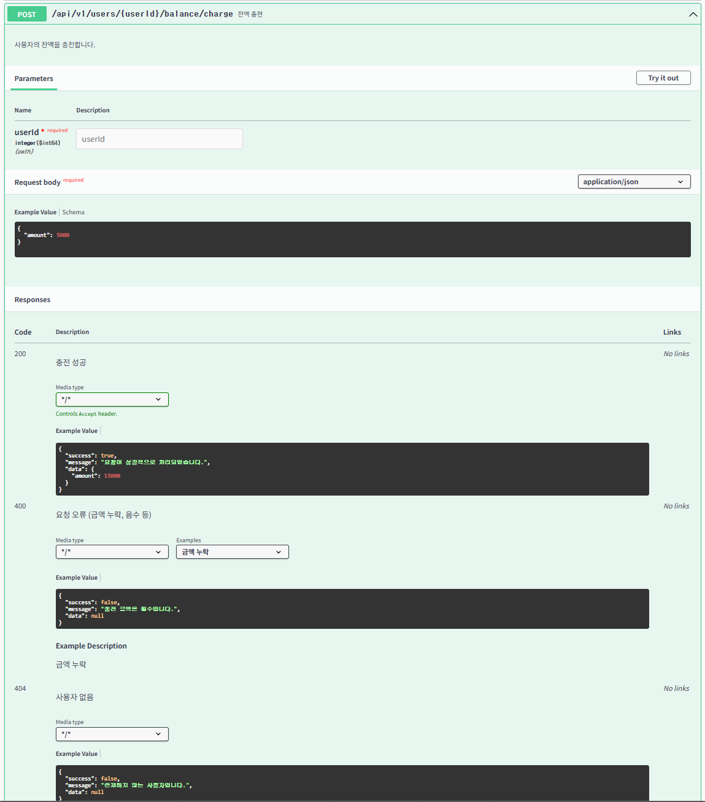
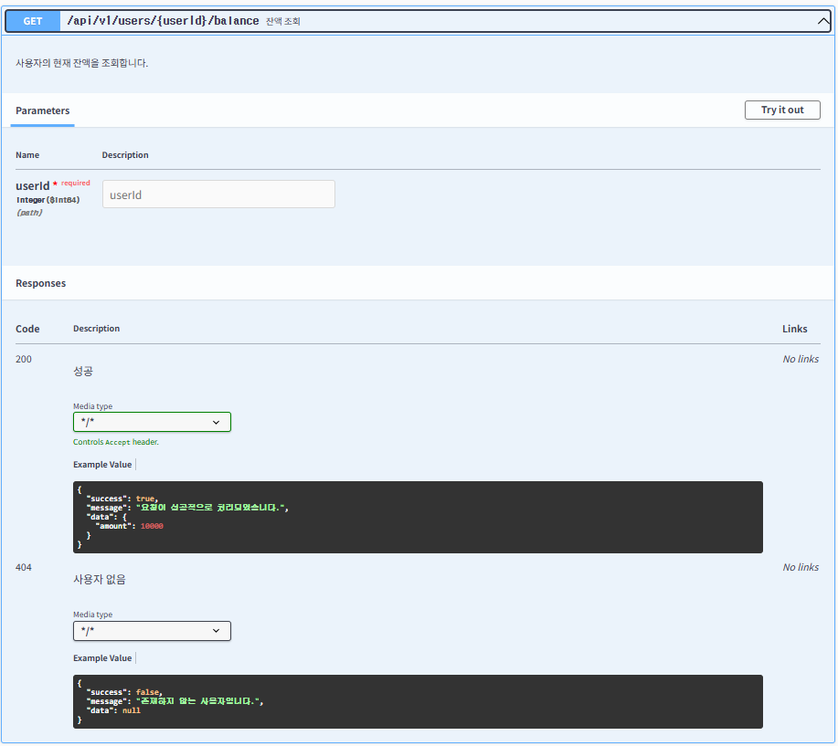
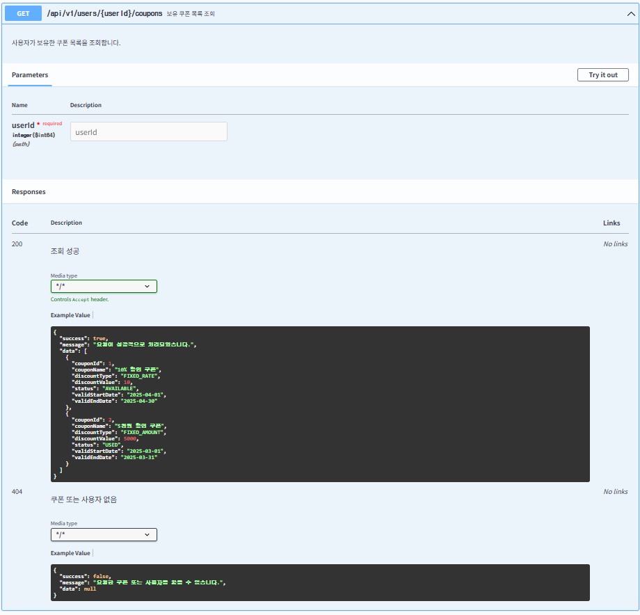
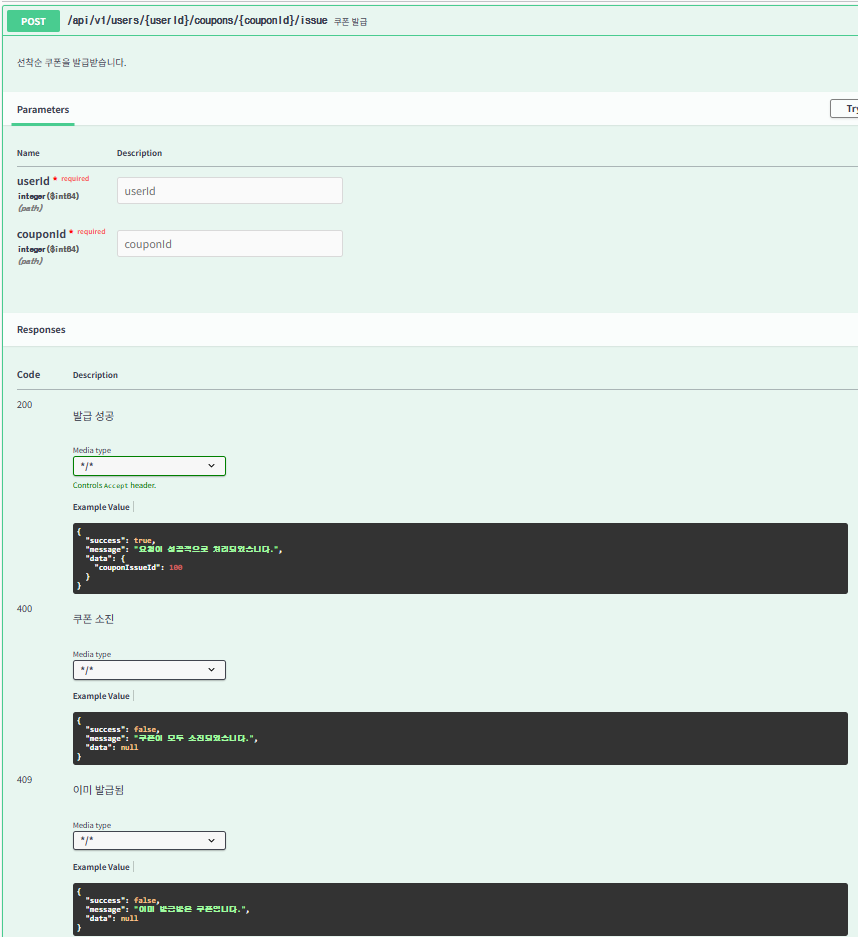
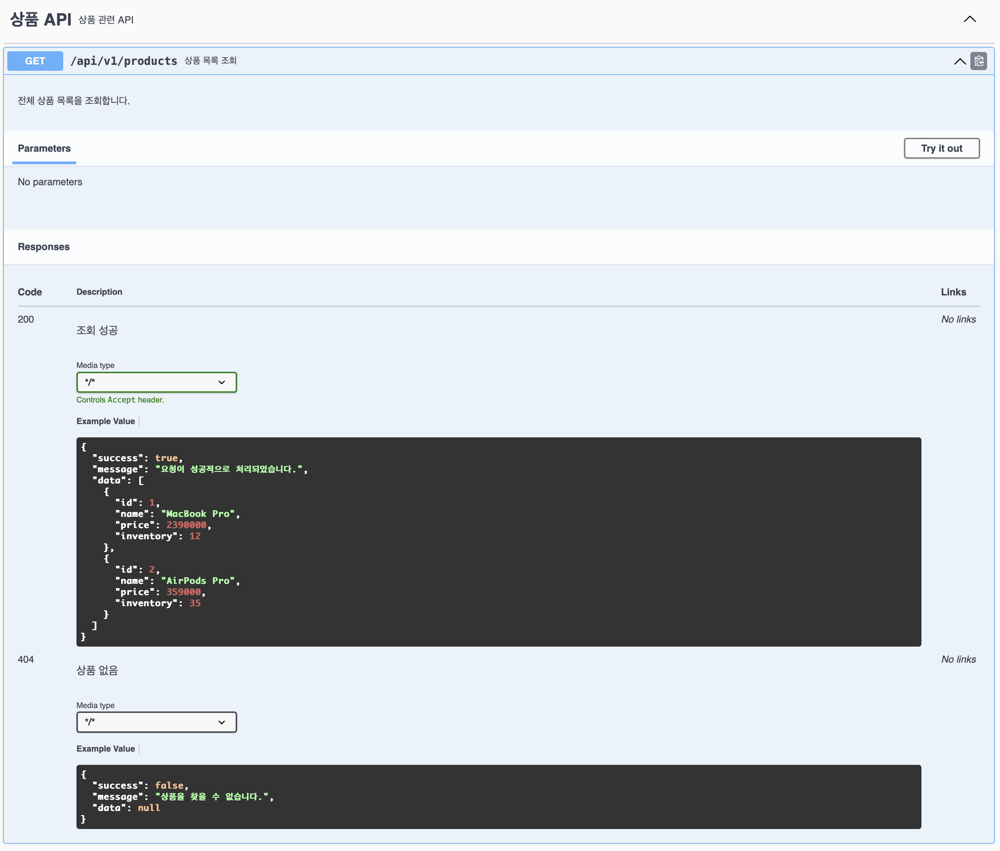
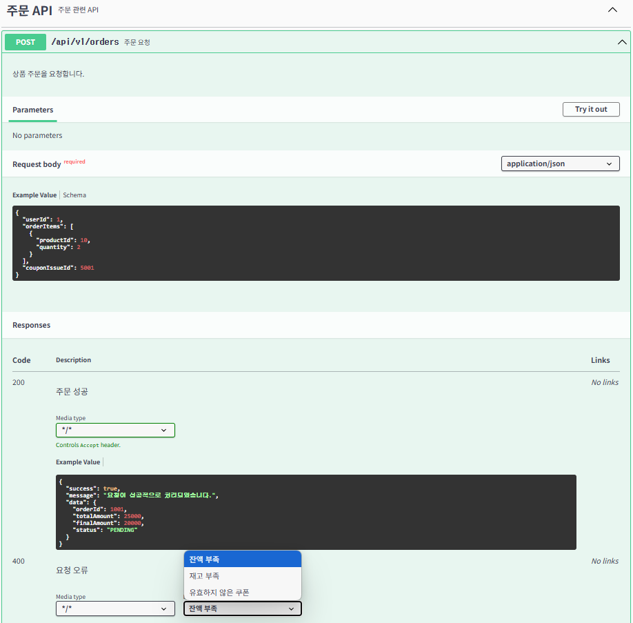
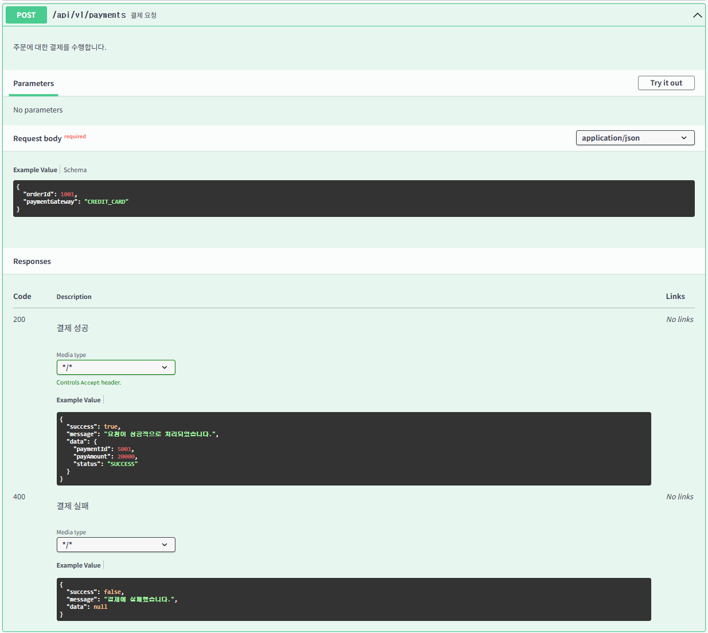
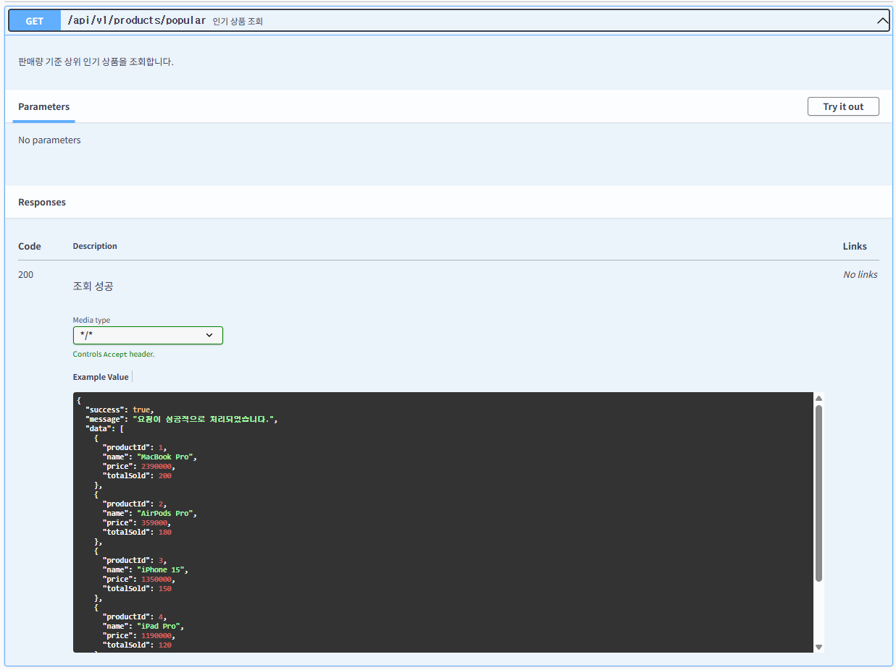

# 📚 E-commerce API 명세서

---
🔗 **[Swagger UI 바로가기](http://localhost:8080/swagger-ui.html)**

---

## [ Index ]

1. [잔액 충전](#1-잔액-충전)
2. [잔액 조회](#2-잔액-조회)
3. [쿠폰 목록 조회](#3-쿠폰-목록-조회)
4. [쿠폰 발급](#4-쿠폰-발급)
5. [상품 목록 조회](#5-상품-목록-조회)
6. [상품 상세 조회](#6-상품-상세-조회)
7. [주문 요청](#7-주문-요청)
8. [결제 요청](#8-결제-요청)
9. [인기 상품 조회](#9-인기-상품-조회)

 
---

## 1. 잔액 충전

 

---

## 2. 잔액 조회

 

---

## 3. 쿠폰 목록 조회

 

---

## 4. 쿠폰 발급

 

---

## 5. 상품 목록 조회

 

---

## 6. 상품 상세 조회

 

---

## 7. 주문 요청

 

---

## 8. 결제 요청

 

---

## 9. 인기 상품 조회

