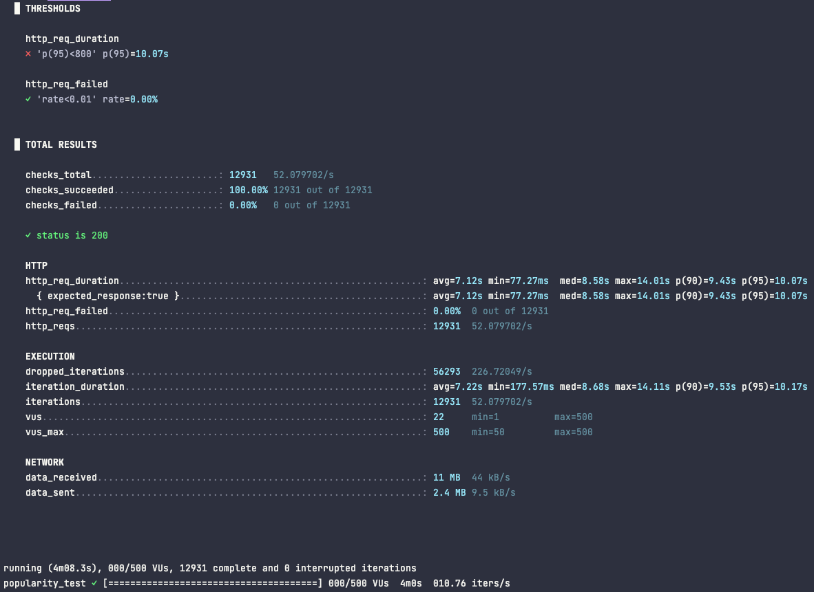
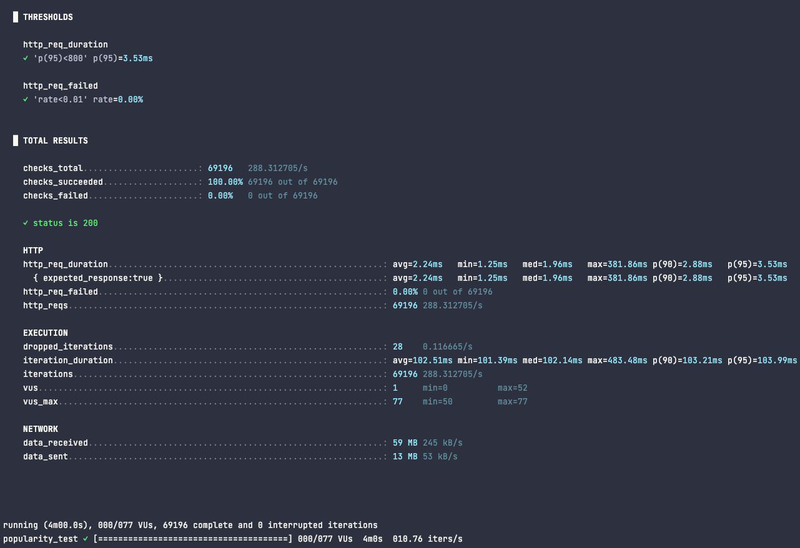
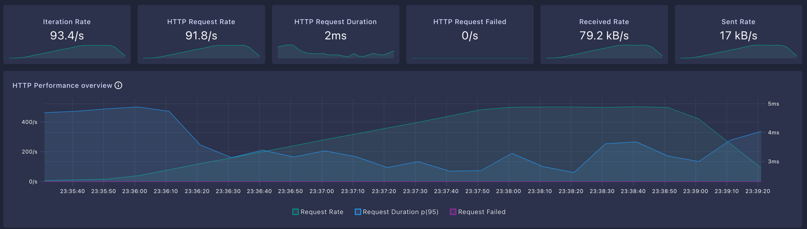
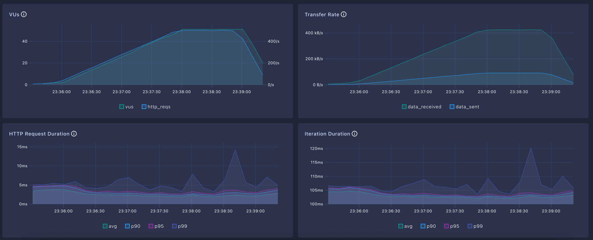

# 📚 E-commerce 캐싱 보고서

---

## ✅ 1. 개요

E-commerce 인기 상품 조회 기능의 성능 개선을 위해 <br>
Redis 기반 캐싱을 도입한 배경, 구현 방식, 성능 테스트 결과를 정리한 보고서입니다.

<br><br>

---

## ✅ 2. 캐싱 적용 전/후 핵심 요약

> ※ 테스트는 총 30만 건의 상품 통계 데이터를 기준으로 수행됨

<br>

| 항목                     | ❗ 캐싱 미적용    | 💫 캐싱 적용        |
| ---------------------- | --------------------- | --------------- |
| **평균 응답 시간**           | **7.12초**             | **2.24ms**      |
| **p95 응답 시간**          | **10.07초** ❌ *(임계치 초과)* | **3.53ms**      |
| **초당 처리량 (RPS)**       | 52.08                 | 288.3           |
| **Dropped Iterations** | **56,293건** | 28건   |

<br>

- P95 응답 시간 : 전체 요청 중 95%가 이 시간 이하로 처리되었음을 의미
- Dropped Iterations : 성능 테스트 중 반복이 제대로 실행되지 않고 생략된 횟수

<br><br>

---

## ✅ 3. 상세 결과

## ❗️ 캐싱 적용 전



<br>


<br>


<br>

> 1. avg=7.12s  p(90)=9.43s  p(95)=10.07s <br>
> - avg: 평균 응답 시간 → 7.12초<br>
> - p(95): 상위 5%를 제외한 최대 응답 시간 → 10.07초<br>
> - ⚠️ p(95)<800 조건을 초과했기 때문에 FAIL 처리됨<br><br>
>
> 2. 처리량 (http_reqs 및 RPS)<br>
> - http_reqs: 12931 (52.08 requests/sec)<br>
> - 총 12,931건 처리했고, 초당 52.08건만 처리 가능했음 → 성능 병목<br><br>
>
> 3. dropped_iterations (처리하지 못한 요청 수)<br>
> - 56,293건이 가상 유저 한계나 응답 지연 때문에 처리되지 못함


<br><br>


## 💫 캐싱 적용 후



<br>



<br>



<br>

> 1. avg=2.24ms  p(90)=2.88ms  p(95)=3.53ms <br>
> - avg: 평균 응답 시간 → 2.24밀리초
> - p(95): 상위 5%를 제외한 최대 응답 시간 → 3.53밀리초
> - PASS: p(95)<800ms 조건 만족<br><br>
>
> 2. 처리량 (http_reqs 및 RPS)
> - http_reqs: 69,196 (288.3 requests/sec)
> - 총 69,196건 처리했고, 초당 288.3건 처리 가능 → 캐싱 적용으로 처리량 대폭 향상<br><br>
>
> 3. dropped_iterations (처리하지 못한 요청 수)
> - 28건만 가상 유저 한계나 응답 지연으로 처리되지 못함 → 거의 모든 요청 정상 처리됨


<br><br><br>

---

## ✅ 4. 테스트 세팅 내용


- 판매 통계 데이터 (product_sales_stats)

| 항목          | 내용                                  |
| ----------- |-------------------------------------|
| 총 데이터 건수    | **300,000건** (10,000개 상품 × 30일)     |
| 상품 수        | 10,000개 (`product_id` 1 \~ 10,000)  |
| 판매 일자 범위    | 최근 30일 (`sale_date` 기준)             |
| 인기 상품 기준    | `product_id % 10 == 0` (약 10%)      |
| 인기 상품 판매량   | 하루 80\~120개 → 30일간 2,400개 이상        |
| 일반 상품 판매량   | 하루 0\~5개 (랜덤)                       |
| 총 판매 금액 계산식 | `quantity_sold × 1,000원` (고정 단가 사용) |

<br>

- 상품 데이터 (product)

| 항목      | 내용                                                                                          |
| ------- | ------------------------------------------------------------------------------------------- |
| 상품 수    | 10,000개 (`product_id` 1 \~ 10,000)                                                          |
| 카테고리 수  | 10개                                                                                         |
| 카테고리 분포 | - 인기 카테고리 2개(`electronics`, `fashion`) → 40%<br> - 일반 카테고리 6개 → 50%<br> - 저빈도 카테고리 2개 → 10% |
| 상품명     | `Product-{productId}` 형식으로 자동 생성                                                            |
| 가격      | 5,000원 \~ 5,000,000원 범위의 랜덤 값                                                               |
| 생성/수정일자 | 모두 `NOW()` 기준으로 일괄 삽입                                                                       |

<br><br>


- k6 테스트 조건
```javascript

export const options = {
    scenarios: {
        popularity_test: {
            executor: 'ramping-arrival-rate',  // "초당 요청 수"를 점차적으로 증가시킴
            startRate: 50,                     // 테스트가 시작되면 매 초마다 설정한 개수 만큼 요청 발생
            timeUnit: '10s',                   // rate 기준 단위 (10초마다 요청 수 계산)
            preAllocatedVUs: 50,               // 초기로 확보할 가상 유저 수
            maxVUs: 500,                       // 최대 가상 유저 수
            stages: [
                { target: 200, duration: '30s' },   // 30초 동안 초당 요청을 200까지 증가 (Warming up)
                { target: 5000, duration: '2m' },   // 2분 동안 초당 요청을 5000까지 증가 (부하 증가)
                { target: 5000, duration: '1m' },   // 1분 동안 초당 5000 유지 (Peak 부하)
                { target: 100, duration: '30s' },   // 30초 동안 부하 감소 (Cool down)
            ],
        },
    },
    thresholds: {
        http_req_duration: ['p(95)<800'],  // 95% 요청이 800ms 미만이어야 함
        http_req_failed: ['rate<0.01'],    // 실패율 1% 이하 유지
    },
};
```

<br><br>

---


## ✅ 5. 캐시 적용 배경 – 인기 상품 조회 
(1) 배경
- 인기 상품 조회 시 GROUP BY, SUM, JOIN 연산이 매번 실행되어 DB 부하 발생
- 주요 필터: category, minSold, days, limit

(2) 도입 이유
- 조회 빈도가 높고, DB 연산 비용이 큼
- 실시간 정합성보다 속도가 더 중요

(3) 캐싱 전략 (Cache Aside 선택)
- 애플리케이션이 먼저 Redis 조회 → 미스 시 DB 조회 후 캐시에 저장
- 장점: 단순 구현, 유지보수 용이, DB fallback 가능

<br>

### 🎯 캐싱 전략 종류

| 전략명             | 특징                                     | 장점                                           | 단점                                             |
| --------------- | -------------------------------------- | -------------------------------------------- | ---------------------------------------------- |
| **Cache Aside** | 애플리케이션이 캐시를 조회하고, 미스 시 DB 조회 후 캐시 저장   | - 구현이 단순하고 유연함<br>- 캐시 장애 시에도 DB fallback 가능 | - 캐시 미스 시 동시 다발적으로 DB 접근 시도 가능 (스탬피드 위험)       |
| Read Through    | 캐시에서 먼저 조회, 없으면 내부적으로 DB에서 조회하여 캐시에 저장 | - 정합성 유지 용이<br>- 캐싱 로직 분리 가능                 | - 캐시 제공자 장애 시 서비스 전체 영향<br>- 적용 구조가 더 복잡할 수 있음 |
| Write Through   | 쓰기 시 DB와 캐시를 동시에 갱신                    | - 항상 최신 상태 유지<br>- 캐시 불일치 방지                 | - 쓰기 성능 저하 가능<br>- 쓰지 않아도 캐시가 채워져 리소스 낭비 가능    |


<br><br>

--- 


## ✅ 6. 캐싱 상세 내용

### (1) 캐시 키 생성 기준
- 파라미터 조합: category-minSold-days-limit-baseDate
<br>

- 생성된 Redis 캐시 키 예시
  ```
  popular:electronics-100-7-10-2025-05-02
  ```

<br>

### (2) TTL 계산

- TTL은 조회한 날짜(baseDate)의 23:59:59까지 유지됩니다.
- 자정이 지나면 TTL을 1시간으로 설정하며, `baseDate`가 과거일 경우에도 TTL을 1시간으로 설정하거나 즉시 만료됩니다.

```java
public class EndOfDayTtlStrategy implements TtlStrategy {
  @Override
  public Duration computeTTL(Object keyParams) {
    LocalDate baseDate = command.baseDate() != null ? command.baseDate() : LocalDate.now();
    LocalDateTime endOfDay = baseDate.atTime(23, 59, 59);
    Duration duration = Duration.between(LocalDateTime.now(), endOfDay);

    if (duration.isNegative()) {
      return Duration.ofHours(1);
    }

    return duration;
  }
}
```

<br><br>

--- 

## ✅ 7. 결론
- 성과
  - 평균 응답 시간: 7.12초 → 2.24ms (수치상 큰 차이를 보이며 개선됨)
  - 처리량: 52.08 → 288.3 req/sec (약 5.5배 향상)

- 향상 원인
  - Redis 캐싱 전략을 통해 빈번한 조회 요청을 메모리 기반 응답으로 전환하여  
    데이터베이스 부하를 줄이고 처리 속도를 대폭 개선함
