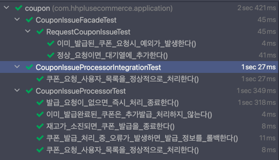

# 📚 E-commerce 선착순 쿠폰 발급 시스템 개선

<br>

## ✅ 1. Redis 기반으로 개선하는 이유

기존 선착순 쿠폰 발급은 비관적 락과 분산 락으로 동시성 이슈를 처리했습니다.<br>
하지만 락 기반 제어 방식은 <br>
락 충돌과 대기 시간 증가로 인해 응답 지연과 성능 저하를 초래할 수 있다는 단점이 있습니다.<br><br>

반면 Redis는 메모리 기반으로 빠른 속도를 제공하며 <br>
ZSet 등 원자적 연산이 가능한 자료구조를 제공해 락 없이도 동시성 문제를 안정적으로 처리할 수 있습니다.<br><br>

선착순 쿠폰처럼 짧은 시간에 많은 요청이 몰리는 상황에서는<br>
Redis 기반 구조가 더 높은 처리 성능을 발휘할 것으로 판단되어 이를 적용해 개선하였습니다.

<br><br>

---

## ✅ 2. Redis 기반 선착순 쿠폰 발급 처리 흐름

<br>

> Redis 기반 선착순 쿠폰 발급은 <br>
> (로직1)과 (로직2)로 나누어서 처리하였습니다.


이유
- (로직1) 사용자 쿠폰발급 요청처리는<br>
  중복 체크 후 요청을 대기열에 등록하고 즉시 성공 응답을 반환해 <br>
  빠른 응답으로 사용자 경험을 개선하고자 하였습니다.  <br><br>

- 로직2(실제 쿠폰 발급 처리)는 <br>
  별도의 스케줄러가 배치 단위로 대기열을 처리해서<br>
  중복 발급 확인, 재고 차감, DB 기록 등 핵심 작업을 보다 안정적으로 수행할 수 있을 것으로 판단했습니다. <br> <br>

<br>


> (로직1) 사용자 요청 처리


(1) 사용자가 쿠폰 발급을 요청하면, Redis에서 중복 발급 여부를 SISMEMBER 명령으로 확인합니다.

(2) 중복 발급여부 확인 후, 요청을 대기열에 ZADD로 타임스탬프와 함께 추가합니다.

(3) 즉시 사용자에게 발급 요청 성공 응답을 반환합니다.


<br><br>

> (로직2 ) 실제 쿠폰 발급 처리


<br>

(1) 스케줄러가 일정 간격으로 대기열에서 배치 단위(`ZPOPMIN`)로 요청을 꺼냅니다.

```java
Set<String> poppedUsers = couponIssuePort.popRequests(requestKey, batchSize);
if (poppedUsers == null || poppedUsers.isEmpty()) {
        return;
}
```

<br>

(2) 각 요청에 대해 다시 중복 발급 여부를 확인하며<br>
이미 발급된 경우에는 DB에 실패 상태를 기록합니다.

```java
/** 중복 발급 여부 체크 */
public boolean isIssued(String couponIssuedKey, String userId) {
    return redisTemplate.opsForSet().isMember(couponIssuedKey, userId);
}
```

<br>

(3) 쿠폰 재고(DECR)를 차감하고 <br>
재고가 소진되면 쿠폰 상태를 `FINISHED(재고 소진)`로 변경합니다.

```java
Long stockLeft = couponIssuePort.decrementStock(stockKey);
if (stockLeft == null || stockLeft < 0) {
   // 재고 부족 시 재고 복구 및 쿠폰 상태 마감 처리
   couponIssuePort.incrementStock(stockKey);
   couponService.finishCoupon(couponId);
   continue;
}
```

<br>

(4) 성공한 쿠폰 발급은 발급 기록(`SADD`)에 등록하고 발급 성공 상태를 DB에 저장합니다.
```java
couponIssuePort.addIssuedUser(issuedKey, userIdStr);

try {
    couponService.issueCoupon(new CouponCommand(Long.valueOf(userIdStr), couponId));
} catch (Exception e) {
    // DB 발급 실패 시 발급 완료 등록 취소 및 재고 복구
    couponIssuePort.removeIssuedUser(issuedKey, userIdStr);
    couponIssuePort.incrementStock(stockKey);
    throw e;
  }
}
```

<br><br>

---

## ✅ 3. 테스트

<br>
 
통합/단위테스트를 진행하였으며 다음과 같은 시나리오로 진행하였습니다. <br>

```java
@Test
void 쿠폰_요청_사용자_목록을_정상적으로_처리한다() throws InterruptedException {
    // given
    Coupon coupon = couponService.getCoupon(TEST_COUPON_ID);
    assertThat(coupon.getIssueStatus()).isNotEqualTo(CouponIssueStatus.FINISHED);

    String requestKey = "coupon:request:" + TEST_COUPON_ID;

    redisTemplate.opsForZSet().add(requestKey, "1", System.currentTimeMillis());
    redisTemplate.opsForZSet().add(requestKey, "2", System.currentTimeMillis());
    redisTemplate.opsForZSet().add(requestKey, "3", System.currentTimeMillis());

    // when
    processor.processCouponIssues(TEST_COUPON_ID, 5);

    // then
    Thread.sleep(500);

    String issuedKey = "coupon:issued:" + TEST_COUPON_ID;
    Set<String> issuedUsers = redisTemplate.opsForSet().members(issuedKey);

    assertThat(issuedUsers).contains(
            String.valueOf(1L),
            String.valueOf(2L),
            String.valueOf(3L)
    );

    Coupon updatedCoupon = couponService.getCoupon(TEST_COUPON_ID);
    assertThat(updatedCoupon.getIssueStatus()).isNotEqualTo(CouponIssueStatus.FINISHED);
}
```

<br>




<br><br>

---


## ✅ 4. 결론 

이번 Redis 기반 선착순 쿠폰 발급 시스템 개선은 <br>
기존 락 방식의 일부 한계를 완화하는 데 도움이 되었으며 <br>
Redis의 빠른 처리 속도와 원자적 연산 덕분에 성능 향상도 기대할 수 있었습니다. <br><br>

데이터 영속성 문제는 있지만 <br>
RDB 백업으로 어느 정도 보완이 가능하다고 판단했습니다. <br><br>

추가로 Kafka 같은 메시징 시스템을 도입해 비동기 이벤트 처리 방식을 적용하면<br>
시스템 안정성과 확장성을 높일 수 있을 것으로 기대합니다.<br>
