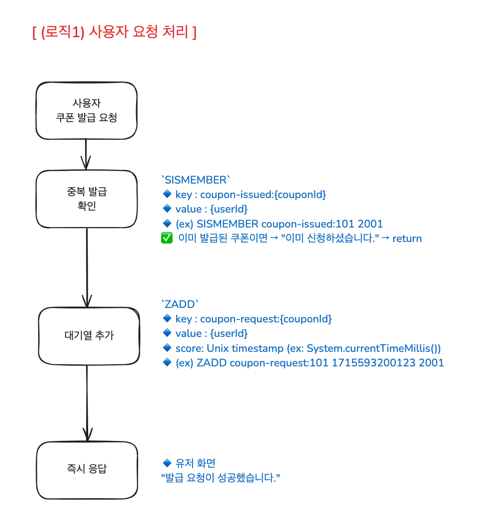
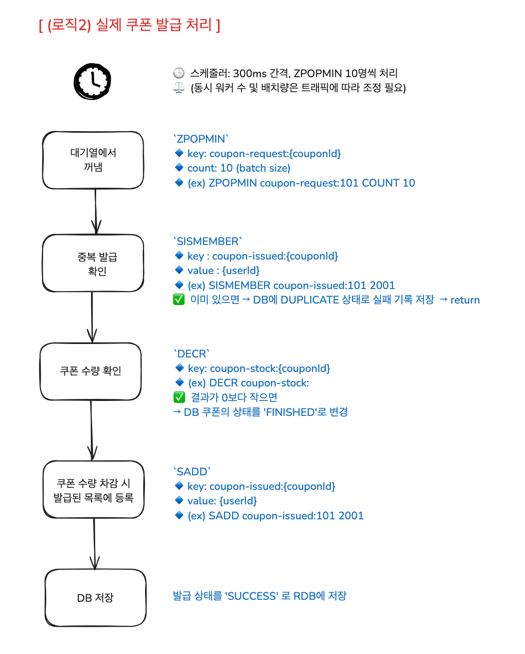

# 📚 E-commerce 선착순 쿠폰 발급 시스템 개선

<br>

## ✅ 1. Redis 기반으로 개선한 이유

기존 선착순 쿠폰 발급은 `비관적 락`과 `분산 락` 등으로 동시성 이슈를 처리했습니다.<br>
하지만 락 기반 제어 방식은 <br>
락 충돌과 대기 시간 증가로 인해 응답 지연과 성능 저하를 초래할 수 있다는 단점이 있습니다.<br><br>

반면 `Redis`는 메모리 기반으로 빠른 속도를 제공합니다. <br>
ZSet, Set 같은 자료구조로 중복 체크나 순서 정렬 같은 작업을 빠르게 처리하는 장점이 있습니다. <br><br>

특히 선착순 쿠폰처럼 `짧은 시간에 요청이 몰리고, 순서가 중요한 상황`에서는  
락보다 Redis의 원자적 연산과 정렬 구조가 더 효율적이라고 판단하였습니다.

<br><br>

---

## ✅ 2. 결론

<br>

Redis의 빠른 처리 속도와 원자적 연산을 활용해 <br>
전반적인 성능이 향상됨을 확인할 수 있었습니다.<br><br>


| 항목                                  | 비관적 락     | Redis 개선 코드 | 개선 효과 |
| ----------------------------------- | --------- |-------------|------|
| **Avg 응답 시간**  | **256ms** | **16ms**    | 🔻 **15배 감소** |
| **p95 응답 시간**                       | **655ms** | **49ms**    | 🔻 **약 13배 감소** |
| **p99 응답 시간**                       | **983ms** | **89ms**    | 🔻 **11배 감소** |
| **평균 iteration duration**           | 360ms     | 120ms       | 🔻 **3배 감소** |
| **Request Rate**                    | 161.88/s  | 485.17/s    | ⏫ **3배 증가** |
| **http\_req\_failed**               | 0.83/s    | 0/s         |      |
| **데이터 수신량**                         | 13.4MB    | 40.6MB      | ⏫ **3배 이상 증가** |
| **데이터 전송량**                         | 7.16MB    | 21.5MB      | ⏫ **3배 증가** |


<br><br>

### ❗️ 비관적락 코드 (선착순 쿠폰 발급)


<br><br>


### 💫 Redis 기반 개선 코드 (선착순 쿠폰 발급)


<br><br>

---
<br>

저는 (로직1) `유저의 쿠폰발급 요청처리`와 <br>
(로직2) `실제 쿠폰 발급 처리(스케쥴러)` 를 나누어 처리하는 방식을 택하였습니다. <br><br>
이 방식은 다음과 같은 한계점을 가지고 있습니다. <br><br>

### ❗ 문제점 및 보완 방법

| 문제점                                                                                         | 보완 방법                                    |
|----------------------------------------------------------------------------------------------|------------------------------------------|
| **1. 실시간성 부족**<br>발급 요청이 즉시 처리되지 않아 사용자 입장에서 발급 결과 확인이 지연될 수 있음                             | 사용자에게 `"발급 요청 되었습니다"` 등의 피드백 UI 제공 필요    |
| **2. 요청 유실 가능성**<br>스케줄러 동작 중 예외나 장애 발생 시, Redis 대기열의 일부 요청이 누락되거나 처리되지 않을 수 있음           | Redis 큐 방식의 구조적인 단점... 사실상 MQ 방식이 필요한 이유 |
| **3. 발급 실패 시 재처리 한계**<br>DB 처리 중 예외 발생 시 Redis 재고 복원 및 기록 삭제를 시도하나, 중간 실패 시 트랜잭션 보장이 어려움  | 트랜잭션이 필요한 경우 메시지 큐 기반 설계로 개선             |
| **4. 스케줄러 병목 가능성**<br>단일 스케줄러로 모든 요청을 순차 처리할 경우, 대기열 길이에 따라 처리 병목 발생 가능                   | 멀티 스레드 기반 스케줄러 또는 분산 워커 구조 도입 고려         |

<br><br>

그럼에도 대용량 트래픽이 몰리는 상황에서는<br>
즉시 쿠폰 발급하는 것보다 로직을 분리하여 처리하는 방식이<br>
더 안정적이라고 판단하였습니다.<br><br>

이번 개선을 통해 Redis의 강점을 충분히 느낄 수 있었고 <br>
추후 Kafka 같은 메시징 시스템 도입으로 비동기 이벤트 처리 방식을 적용하면<br>
시스템 안정성과 확장성이 더 높아질 것이라 생각됩니다.

<br><br>

---


## ✅ 3. Redis 기반 선착순 쿠폰 발급 처리 구조

<br>

Redis 기반 선착순 쿠폰 발급은<br>
(로직1) 사용자 요청 처리와 (로직2) 실제 쿠폰 발급 처리 두 단계로 나누어 구현하였습니다.<br><br><br>


> (로직1) 유저의 쿠폰발급 요청처리




(1) 사용자가 쿠폰 발급을 요청하면, Redis에서 중복 발급 여부를 `SISMEMBER` 명령으로 확인합니다.

(2) 중복 발급여부 확인 후, 요청을 대기열에 `ZADD`로 타임스탬프와 함께 추가합니다.

(3) 즉시 사용자에게 발급 `요청 성공` 응답을 반환합니다.

<br>

→ 빠른 ‘요청 성공’ 응답으로 사용자 경험은 개선하되,
실제 발급 여부는 후속 처리(로직2)를 통해 보다 안정적으로 판단하도록 하였습니다.


<br><br>

> (로직2) 실제 쿠폰 발급 처리



<br>

(1) 스케줄러가 일정 간격으로 대기열에서 배치 단위(`ZPOPMIN`)로 요청을 꺼냅니다.

```java
Set<String> poppedUsers = couponIssuePort.popRequests(requestKey, batchSize);
if (poppedUsers == null || poppedUsers.isEmpty()) {
        return;
}
```

<br>

(2) 각 요청에 대해 다시 중복 발급 여부를 확인하며<br>
이미 발급된 경우에는 DB에 실패 상태를 기록합니다.

```java
/** 중복 발급 여부 체크 */
public boolean isIssued(String couponIssuedKey, String userId) {
    return redisTemplate.opsForSet().isMember(couponIssuedKey, userId);
}
```

<br>

(3) 쿠폰 재고(DECR)를 차감하고 <br>
재고가 소진되면 쿠폰 상태를 `FINISHED(재고 소진)`로 변경합니다.

```java
Long stockLeft = couponIssuePort.decrementStock(stockKey);
if (stockLeft == null || stockLeft < 0) {
   // 재고 부족 시 재고 복구 및 쿠폰 상태 마감 처리
   couponIssuePort.incrementStock(stockKey);
   couponService.finishCoupon(couponId);
   continue;
}
```

<br>

(4) 성공한 쿠폰 발급은 발급 기록(`SADD`)에 등록하고 발급 성공 상태를 DB에 저장합니다.
```java
couponIssuePort.addIssuedUser(issuedKey, userIdStr);

try {
    couponService.issueCoupon(new CouponCommand(Long.valueOf(userIdStr), couponId));
} catch (Exception e) {
    // DB 발급 실패 시 발급 완료 등록 취소 및 재고 복구
    couponIssuePort.removeIssuedUser(issuedKey, userIdStr);
    couponIssuePort.incrementStock(stockKey);
    throw e;
  }
}
```

<br><br><br>

---

## ✅ 4. 테스트 세팅 내용


```java
// k6 테스트 스크립트

import http from 'k6/http';
import { check, sleep } from 'k6';

export const options = {
    stages: [
        { duration: '1m', target: 50 },   // 1분 동안 50명 점진적 증가
        { duration: '2m', target: 50 },   // 2분 동안 50명 유지
        { duration: '1m', target: 100 },  // 1분 동안 100명 점진적 증가
        { duration: '1m', target: 100 },  // 1분 동안 100명 유지
        { duration: '1m', target: 0 },    // 1분 동안 점진적 종료
    ],
    thresholds: {
        http_req_duration: ['p(95)<800'],
        http_req_failed: ['rate<0.01'],
    },
};

const MAX_USER_ID = 5000;  // 5천명 유저 중 랜덤 선택

export default function () {
    const userId = Math.floor(Math.random() * MAX_USER_ID) + 1;
    const couponId = 1;

    const url = `http://localhost:8080/api/v2/users/${userId}/coupons/${couponId}/issue`;
    const res = http.post(url);

    check(res, {
        'status is 200 or 400 or 409': (r) => [200, 400, 409].includes(r.status),
    });

    sleep(0.1);
}
```
