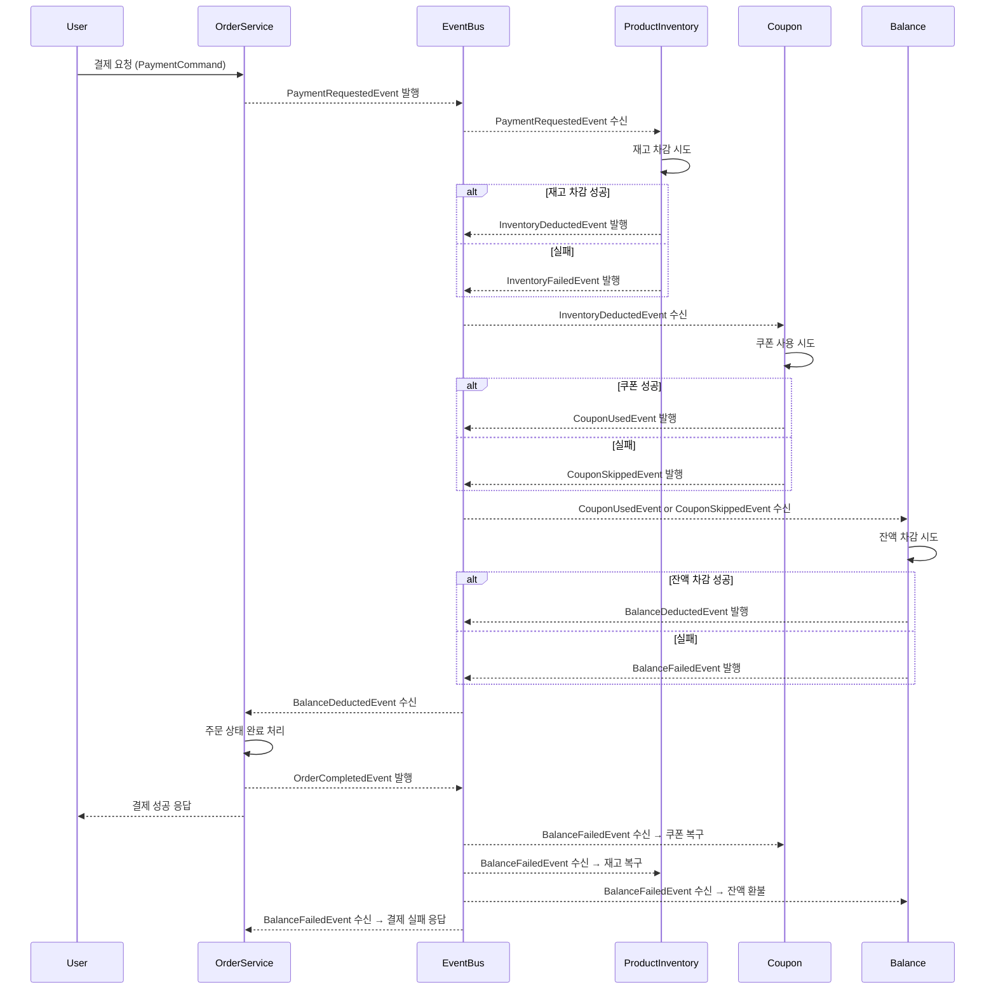

# 📝 서비스 확장에 따른 트랜잭션 분리와 보상 설계 보고서

<br>

## 1. 보고서 목적

주문/결제 시스템은 트래픽 증가와 기능 확장으로 점점 더 복잡해지고 있습니다. <br>
이에 따라 서비스를 분산된 구조로 운영하려는 시도가 늘고 있지만<br>
트랜잭션 분리, 데이터 정합성 저하, 장애 복구의 어려움 같은 새로운 문제도 함께 발생합니다.<br><br>

서비스 간 통신과 책임이 분리되면 확장성과 유연성은 높아지지만<br>
트랜잭션 경계가 흐려지고 장애가 전파되기 쉬운 구조적 변화도 수반됩니다.<br><br>

이 문서는 서비스 간 트랜잭션이 분리된 구조에서  <br>
상태 정합성과 장애 복구를 어떻게 설계할 수 있을지에 중점을 두고 있습니다.  <br>
복구 책임과 보상 흐름을 각 서비스의 역할 안에서 정의하고<br>
실패가 발생하더라도 전체 흐름이 안정적으로 유지될 수 있도록 고려한 설계 방향을 정리해 보았습니다.

<br><br>

---

## 2. 결론

### 🟡 분산 트랜잭션 환경에서의 도메인 복구 설계

트랜잭션 경계를 기능 단위로 분리하고, 각 구성 요소가 복구 책임을 갖도록 설계했습니다.<br>
멱등성 보장, 상태 검증, 이벤트 기반 또는 정기 점검 방식의 복구 전략을 적용하여 <br> 
장애 상황에서도 보상 트랜잭션을 통해 상태를 되돌릴 수 있도록 했습니다. <br>

### 🟡  설계 대상 도메인 구성

```java
[ProductInventory (재고)]
[Coupon (쿠폰)]
[Balance (잔액)]
[Order + Payment (주문 및 결제)]
```

<br><br>


### 🟡 결제 흐름 예시 (Sequence Diagram)



<br><br><br>


### 🟡 도메인별 복구 전략 및 트리거

<br>
각 도메인은 자체적인 상태 복구 책임을 갖도록 설계되었으며 <br>
복구 과정에서 중복 호출이나 부작용을 방지하기 위해<br>
요청 식별자(Request ID), 상태 검증, DB 제약 조건 등을 활용한 멱등성 보장을 기본 원칙으로 따릅니다.<br><br>

장애 상황이 반드시 실시간으로 감지되지 않을 수 있다는 전제하에 <br>
도메인별로 실패 이벤트 수신 또는 정기 점검을 통해 복구를 수행하는 구조로 구성되었습니다.<br><br>

| 도메인                         | 복구 전략           | 트리거 및 설명                                                                                                                          |
| --------------------------- | --------------- | --------------------------------------------------------------------------------------------------------------------------------- |
| **Inventory (재고)**          | 재고 복원 API 호출    | 재고 차감 실패 또는 후속 단계(잔액 차감 등) 실패 시, 재고 상태를 되돌리는 API를 호출합니다.<br>멱등성은 상품 ID + 요청 키를 기준으로 처리합니다. <br>이벤트 기반 복구 외에, 정합성 확인을 위한 주기 배치도 포함됩니다. |
| **Coupon (쿠폰)**             | 쿠폰 사용 취소 API 호출 | 쿠폰 사용 후 결제 실패 시 쿠폰을 복구합니다. 쿠폰 상태는 '사용됨' → '복원됨'으로 전환되며, <br>같은 쿠폰이 이중 사용되지 않도록 DB 제약과 상태 체크를 통해 보호합니다.                                |
| **Balance (잔액)**            | 잔액 환불 API 호출    | 결제 실패 시 환불 처리. 동일 요청에 대해 중복 환불을 방지하기 위해 사용자 ID + 요청 ID 기반으로 환불 상태를 검증합니다. <br>실시간 복구가 실패한 경우, 배치 작업으로 누락된 상태를 점검합니다.                  |
| **Order + Payment (주문/결제)** | 상태 불일치 재조정 및 알림 | 부분 실패 상황에서 주문 상태가 비정상적으로 유지되는 것을 방지하기 위해,<br>‘미결제’, ‘오류’ 상태를 탐지하고 사용자 알림 또는 상태 업데이트를 수행합니다.<br>DLQ 및 수동 복구 대상의 주요 중심점이 되는 도메인입니다. |


<br><br>

### 🟡 장애 처리 수단: DLQ
<br>

DLQ와 주기적 배치는 서로 다른 목적과 기준으로 운영됩니다.<br>

- **DLQ는 ‘명시적으로 실패한 이벤트’를 처리**합니다.  <br>
  → 이벤트 핸들러에서 처리 중 예외가 발생한 경우에만 DLQ로 이동하며<br>
  → 지정된 재시도 횟수 이후에도 실패한 이벤트만 수동/운영자 복구 대상이 됩니다.<br><br>

- **배치 복구는 ‘복구 누락을 사후 탐지’하는 용도**로 사용됩니다.  <br>
  → 이벤트 유실, 핸들러 미실행, 예외 없이 상태 불일치가 남은 경우를 감지하여  <br>
  → 해당 상태를 기준으로 재검증 및 복구 요청을 수행합니다.<br><br>

이를 통해 중복 처리나 충돌 없이
**DLQ는 명시적 실패 복구 경로**,  
**배치는 비정상 상태 탐지 및 보정 경로**로 역할을 분리합니다.

<br><br><br>

---

## 3. 다양한 보상 전략 방법
<br>
서비스 간 트랜잭션을 단일하게 묶기 어려운 구조에서는<br>
하나의 작업 흐름에서 실패가 발생했을 때 이전 단계의 상태를 복구하거나<br>
전체 흐름을 일관되게 정리할 수 있는 보상 전략이 필요합니다.<br><br>

이러한 보상 로직은 크게 두 가지 구성 요소로 나뉩니다.<br>
첫째는 실제 복구를 수행하는 API 등의 복구 동작,<br>
둘째는 이를 실행하게 만드는 트리거 방식(예: 이벤트 수신, 배치 등)입니다.<br><br>

보상의 방식은 도메인 특성이나 비즈니스 중요도에 따라 다양하게 조합되어 적용될 수 있습니다.<br><br>

| 전략                   | 설명                                    | 사용 예                         |
| -------------------- | ------------------------------------- | ---------------------------- |
| **실패 이벤트 수신 및 복구**   | 실패 이벤트를 발행하고, 관련 서비스가 이를 수신해 복구 작업 수행 | 결제 실패 이벤트 → 재고 복원 트리거        |
| **정기 배치 기반 점검 및 보정** | 주기적으로 상태 불일치를 점검하고, 자동 또는 수동으로 보정 수행  | 주문 상태와 결제 결과를 비교해 누락 주문 재처리  |
| **사용자 경험(UX) 중심 처리** | 실패를 사용자에게 안내하거나, 비핵심 흐름으로 간주해 진행 지속   | 쿠폰 실패 시 할인 제외 후 결제 유지        |
| **정책적 보상 처리**        | 복구가 어렵거나 비용이 클 경우, 정책 기반으로 보상 제공      | 복구 실패 시 쿠폰 재발급 및 사용자 알림 제공   |
| **이벤트 기반 보상 (Saga)** | 이벤트 발행 및 보상 이벤트 처리를 통해 상태를 롤백         | 주문 생성 → 재고 예약 실패 → 보상 이벤트 발행 |
| **보상 API 직접 호출**     | 실패 시 이전 단계를 되돌리는 API 호출로 복구 처리        | 재고 복원, 쿠폰 취소 등 상태 복구 API 실행  |
| **주문 취소 처리**         | 실패 시 전체 주문을 취소하여 일관성 확보               | 결제 실패 시 주문 전체를 취소하고 상태 정리    |

<br><br><br><br>

---

## 4. 한계점 및 보완 방법

<br>

| 상호작용                                                | 잠재적 위험 요소                                                                       | 대응 방향                                                                                                             |
| --------------------------------------------------- | ------------------------------------------------------------------------------- | ----------------------------------------------------------------------------------------------------------------- |
| **ProductInventory ↔ OrderPayment**<br>(재고 차감 및 복원) | - 재고 복원 API 호출 실패 시, 수량 누락으로 인한 정합성 문제 발생 가능<br>- 이벤트 유실 또는 중복 수신 시 중복 복원 처리 우려 | - 복원 API에 재시도, 타임아웃, Circuit Breaker 등 안정화 메커니즘 적용<br>- 실패 이벤트는 DLQ(Dead Letter Queue)에 저장하고, 배치 기반으로 재확인 및 보정 처리 |
| **Coupon ↔ OrderPayment**<br>(쿠폰 사용 및 복원)           | - 쿠폰 사용 실패 시 할인 누락 외에, 쿠폰 복원이 누락되면 사용자 신뢰 저하 우려<br>- 복원 지연 시 쿠폰 이중 사용 가능성 존재    | - 쿠폰 사용/복원 상태를 이벤트 기반으로 관리하고, 타임스탬프 기반으로 추적<br>- 복원 실패 시 정책적으로 자동 재발급 및 사용자 알림<br>- 주기적 배치로 누락 상태 보정 로직 운영        |

<br><br><br>

---
