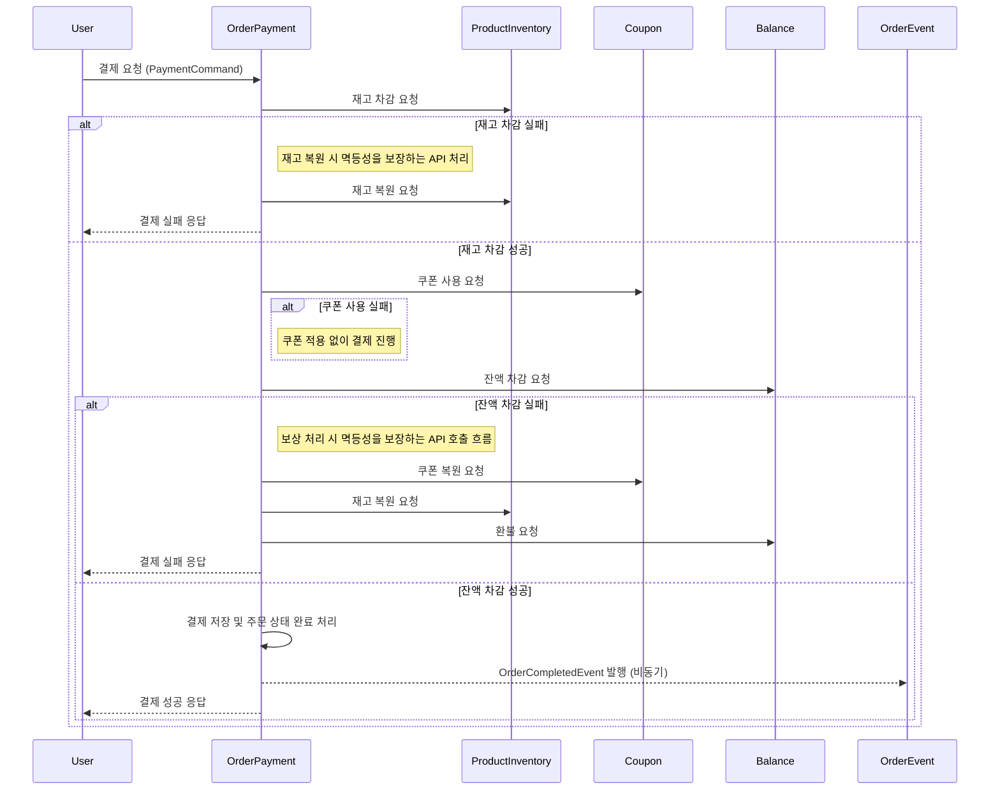
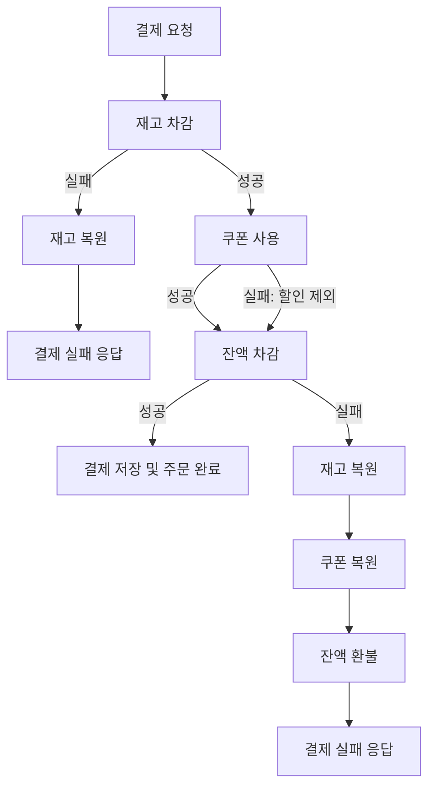

# 📝 서비스 확장에 따른 트랜잭션 분리와 보상 설계 보고서

<br>

## 1. 보고서 목적

본 문서는 주문/결제 시스템의 복잡도와 트래픽 증가에 대응하기 위해 작성되었습니다.<br>
서비스 확장의 한 방향으로, 도메인별로 나눠 독립적으로 배포하는 구조를 가정하고 있습니다.<br><br>

단일 트랜잭션은 데이터 정합성을 효과적으로 보장하지만<br>
시스템이 커지고 서비스 간 연동이 많아질수록 트랜잭션 범위가 넓어지고<br>
그에 따른 성능 저하나 장애 전파 위험도 함께 증가합니다.<br><br>

이러한 문제를 완화하기 위해 도메인을 기준으로 서비스를 분리하고<br>
각 도메인을 독립적으로 운영하는 구조가 하나의 대안이 될 수 있습니다.<br>
이 경우 서비스 간 트랜잭션은 자연스럽게 분리되며<br>
데이터 정합성과 장애 복구는 도메인 간 협업 수준에서 별도로 설계되어야 합니다.<br>

본 문서는 이러한 분산 트랜잭션 환경에서 발생할 수 있는 문제를 분석하고<br>
각 도메인의 특성과 운영 방식에 적합한 보상 트랜잭션 및 복구 전략 중심으로 해결 방안을 제시하는 것을 목표로 합니다.<br><br>

특히 다음 사항에 중점을 두어 다룹니다.<br>

- 독립적인 배포 단위 간 트랜잭션 분리에 따른 주요 문제
- 서비스별 특성을 고려한 장애 복구 및 데이터 일관성 유지 방안

<br><br>

--- 

## 2. 기대하는 효과

주문/결제 시스템의 트래픽 증가, 기능 복잡도 확대, 변경 빈도 상승 등으로 인해  <br>
기존 모놀리식 구조의 운영 효율이 점차 낮아지고 있습니다.<br><br>

이러한 이유로 도메인별로 나뉜 독립 배포 구조는<br>
확장성과 안정성을 확보하는 대안이 될 수 있습니다.<br>

(1) **도메인별 독립 확장(스케일링) 가능**  
  → 트래픽 양상에 따라, 전체가 아닌 일부 도메인만 유연하게 확장할 수 있음  
  → 모놀리식에서는 전체 시스템을 함께 확장해야 하므로 리소스 낭비가 발생

(2) **배포 단위 분리로 빠른 기능 출시 및 장애 대응 가능**  
  → 한 도메인에 대한 변경이 다른 도메인에 영향을 주지 않음  
  → 모놀리식에서는 전체 재배포가 필요하거나 사이드 이펙트 우려

<br><br>

### 고려해야 할 점 

| 항목                  | 설명                                              |
| ------------------- | ----------------------------------------------- |
| **트랜잭션 복잡성 증가**     | 분리된 서비스 간 연계 트랜잭션 처리 시 보상 로직, 멱등성 등 별도 설계가 필요함       |
| **데이터 정합성 유지 어려움**  | 독립된 데이터 저장소로 인해 이벤트 기반 복구나 상태 보정 전략이 요구됨             |
| **운영 및 테스트 복잡성** | 서비스 수 증가에 따라 테스트, 배포, 장애 감지 및 복구 등을 체계화할 수 있는 전략이 함께 요구됨 |

<br><br><br>

--- 

## 3. 결론


### 🟡 선택한 도메인 분리 전략 및 운영 원칙

이번 설계는 단순한 기능 분할보다는 <br>
트랜잭션 실패 시 복구 책임과 상태 일관성 유지가 필요한 범위를 기준으로 도메인을 분리하였습니다.<br><br>

도메인 간 트랜잭션이 분리되면서, 서비스 간 호출은 이벤트 기반 메시징과 멱등성 보장 API 호출이 혼합된 구조로 이루어집니다.<br>
주요 상태 변화는 이벤트를 통해 전달되며, 일부 핵심 처리에는 명시적 API 호출과 보상 로직이 함께 적용됩니다.<br><br>

각 도메인은 독립된 책임과 운영 체계를 가지며, <br>
시스템 전반의 정합성과 복구를 위해 서비스 운영 레이어에서는  <br>
이벤트 기반 장애 감지와 주기적 보정 작업 등 통합적인 복구 체계를 함께 운영합니다.<br><br>

<br>

### 🟡  설계 대상 도메인 구성

```java
[ProductInventory (재고)]
[Coupon (쿠폰)]
[Balance (잔액)]
[Order + Payment (주문 및 결제)]
```

<br><br>


### 🟡 결제 흐름 예시 (Sequence Diagram)

> 아래 시퀀스는 서비스 간 호출을 멱등성 기반 API로 구성한 결제 흐름 예시입니다. <br>
> 각 단계에서는 실패 발생 시 보상 트랜잭션 또는 정책적 복구 로직이 명시적으로 적용됩니다.




<br><br><br>


### 🟡 도메인별 복구 전략 및 트리거

<br>
각 도메인에서는 복구 과정에서 중복 호출로 인한 부작용을 방지하기 위해<br>
복구 API는 요청 식별자(Request ID), 상태 확인, DB 제약 조건 등 멱등성 보장 방법을 적용하여<br>
중복 실행과 상태 불일치를 예방합니다.<br><br>

또한 장애 상황에 대응하기 위해 이벤트 기반 감지와 주기적인 배치 점검을 통해<br>
시스템 복구를 효율적으로 처리할 수 있도록 합니다.<br><br>

복구 전략에 대한 세부 트리거는 다음과 같습니다.<br>
- 실패 이벤트는 전달된 오류 코드 또는 상태 값에 따라 발생하며, 각 도메인별로 정의된 이벤트 수신 후 즉시 복구 작업이 시작됩니다.
- 주기적 배치 점검은 설정된 주기마다 실행되어, 복구되지 않은 상태를 점검하고 필요한 복구 작업을 자동으로 수행합니다.<br>


| 도메인                           | 복구 전략           | 복구 트리거 및 운영 방식                |
| ----------------------------- | --------------- | ----------------------------- |
| **Inventory** (재고)            | 재고 복원 API 호출    | 실패 이벤트 수신 또는 주기적 배치 점검을 통한 복구 |
| **Coupon** (쿠폰)               | 쿠폰 사용 취소 API 호출 | 실패 이벤트 또는 정책 기반 배치 작업을 통한 복구  |
| **Balance** (잔액)              | 잔액 환불 API 호출    | 결제 실패 감지 시 자동 환불 처리           |
| **Order + Payment** (주문 및 결제) | 상태 불일치 동기화      | 실패 감지 시 주문 상태 재조정 및 사용자 알림 수행 |


<br><br>

### 🟡 장애 처리 수단: DLQ 및 보상 흐름 (Flowchart)
실패한 이벤트는 **Dead Letter Queue (DLQ)**에 저장되며<br>
재시도 한계 도달 시 수동 복구 프로세스를 트리거합니다. <br>
DLQ에서 관리되는 실패 이벤트는 복구 작업을 추적하고 장애 상황에서 복구가 이루어지도록 지원합니다.<br>

멱등성 API는 실패 이벤트를 통해 호출되어 중복 처리 없이 안정적인 복구를 보장합니다.<br>

<br>



<br><br><br>

---

## 4. 다양한 보상 전략 방법
<br>
서비스 간 트랜잭션을 단일하게 묶기 어려운 구조에서는<br>
하나의 작업 흐름에서 실패가 발생했을 때 이전 단계의 상태를 복구하거나<br>
전체 흐름을 일관되게 정리할 수 있는 보상 전략이 필요합니다.<br><br>

이러한 보상 로직은 크게 두 가지 구성 요소로 나뉩니다.<br>
첫째는 실제 복구를 수행하는 API 등의 복구 동작,<br>
둘째는 이를 실행하게 만드는 트리거 방식(예: 이벤트 수신, 배치 등)입니다.<br><br>

보상의 방식은 도메인 특성이나 비즈니스 중요도에 따라 다양하게 조합되어 적용될 수 있습니다.<br><br>

| 전략                   | 설명                                    | 사용 예                         |
| -------------------- | ------------------------------------- | ---------------------------- |
| **실패 이벤트 수신 및 복구**   | 실패 이벤트를 발행하고, 관련 서비스가 이를 수신해 복구 작업 수행 | 결제 실패 이벤트 → 재고 복원 트리거        |
| **정기 배치 기반 점검 및 보정** | 주기적으로 상태 불일치를 점검하고, 자동 또는 수동으로 보정 수행  | 주문 상태와 결제 결과를 비교해 누락 주문 재처리  |
| **사용자 경험(UX) 중심 처리** | 실패를 사용자에게 안내하거나, 비핵심 흐름으로 간주해 진행 지속   | 쿠폰 실패 시 할인 제외 후 결제 유지        |
| **정책적 보상 처리**        | 복구가 어렵거나 비용이 클 경우, 정책 기반으로 보상 제공      | 복구 실패 시 쿠폰 재발급 및 사용자 알림 제공   |
| **이벤트 기반 보상 (Saga)** | 이벤트 발행 및 보상 이벤트 처리를 통해 상태를 롤백         | 주문 생성 → 재고 예약 실패 → 보상 이벤트 발행 |
| **보상 API 직접 호출**     | 실패 시 이전 단계를 되돌리는 API 호출로 복구 처리        | 재고 복원, 쿠폰 취소 등 상태 복구 API 실행  |
| **주문 취소 처리**         | 실패 시 전체 주문을 취소하여 일관성 확보               | 결제 실패 시 주문 전체를 취소하고 상태 정리    |

<br><br><br><br>

---

## 5. 한계점 및 보완 방법

<br>

| 상호작용                                                | 잠재적 위험 요소                                                                       | 대응 방향                                                                                                             |
| --------------------------------------------------- | ------------------------------------------------------------------------------- | ----------------------------------------------------------------------------------------------------------------- |
| **ProductInventory ↔ OrderPayment**<br>(재고 차감 및 복원) | - 재고 복원 API 호출 실패 시, 수량 누락으로 인한 정합성 문제 발생 가능<br>- 이벤트 유실 또는 중복 수신 시 중복 복원 처리 우려 | - 복원 API에 재시도, 타임아웃, Circuit Breaker 등 안정화 메커니즘 적용<br>- 실패 이벤트는 DLQ(Dead Letter Queue)에 저장하고, 배치 기반으로 재확인 및 보정 처리 |
| **Coupon ↔ OrderPayment**<br>(쿠폰 사용 및 복원)           | - 쿠폰 사용 실패 시 할인 누락 외에, 쿠폰 복원이 누락되면 사용자 신뢰 저하 우려<br>- 복원 지연 시 쿠폰 이중 사용 가능성 존재    | - 쿠폰 사용/복원 상태를 이벤트 기반으로 관리하고, 타임스탬프 기반으로 추적<br>- 복원 실패 시 정책적으로 자동 재발급 및 사용자 알림<br>- 주기적 배치로 누락 상태 보정 로직 운영        |

<br><br><br>

---
