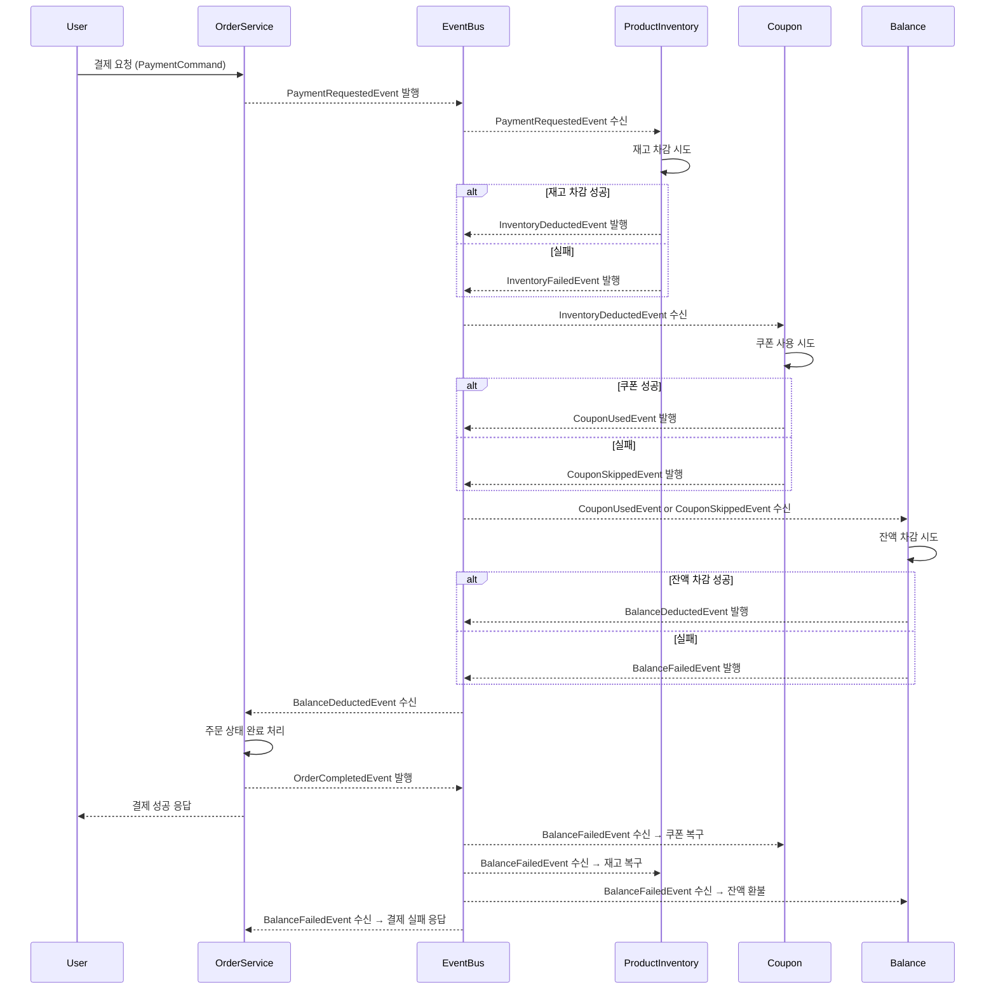

# 📝 서비스 확장에 따른 트랜잭션 분리와 보상 설계 보고서

<br>

## 1. 보고서 목적

주문/결제 시스템은 트래픽 증가와 기능 확장으로 점점 더 복잡해지고 있습니다. <br>
이에 따라 서비스를 분산된 구조로 운영하려는 시도가 늘고 있지만<br>
트랜잭션 분리, 데이터 정합성 저하, 장애 복구의 어려움 같은 새로운 문제도 함께 발생합니다.<br><br>

서비스 간 통신과 책임이 분리되면 확장성과 유연성은 높아지지만<br>
트랜잭션 경계가 흐려지고 장애가 전파되기 쉬운 구조적 변화도 수반됩니다.<br><br>

이 문서는 서비스 간 트랜잭션이 분리된 구조에서  <br>
상태 정합성과 장애 복구를 어떻게 설계할 수 있을지에 중점을 두고 있습니다.  <br>
복구 책임과 보상 흐름을 각 서비스의 역할 안에서 정의하고<br>
실패가 발생하더라도 전체 흐름이 안정적으로 유지될 수 있도록 고려한 설계 방향을 정리해 보았습니다.

<br><br><br>

---

## 2. 결론


### 🟡 분산 트랜잭션 환경에서의 도메인 복구 설계

분산 시스템에서 트랜잭션 경계를 기능 단위로 분리하면
각 서비스는 자체 상태를 책임지고 복구할 수 있어야 합니다. <br>
이에 따라 기본적인 복구 및 보상 처리는 아래와 같은 **공통된 3단계 흐름**을 따릅니다.<br>

> **① 실패 감지 (이벤트 기반) → ② 멱등 복원 API 호출 → ③ 상태 검증 및 보완 처리 (DLQ/배치)**

※ 이 3단계 구조는 모든 도메인에서 공통으로 적용되며, <br>
DLQ, 배치, 재시도는 상황에 따라 선택적으로 적용되는 **보완 수단**일 뿐  <br>
기본 복구 흐름은 "이벤트 기반 감지 → 복원 API"로 일관됩니다. <br>

<br>

### 🟡  설계 대상 도메인 구성

```java
[ProductInventory (재고)]
[Coupon (쿠폰)]
[Balance (잔액)]
[Order + Payment (주문 및 결제)]
```

<br><br>


### 🟡 결제 흐름 예시 (Sequence Diagram)




<br><br><br>


### 🟡 도메인별 복구 전략 및 트리거

> ※ 아래 내용은 코레오그라피 구조로 전환되었을 경우를 기준으로 각 도메인의 복구 흐름입니다.  
> 복구는 실패 감지 → 멱등 복원 API 호출 → 보완 감시 처리의 흐름으로 수행되며,  
> 감지는 주로 이벤트 기반으로 이루어지고, DLQ와 배치 점검은 보완 수단으로 함께 적용됩니다.

| 도메인                         | 실패 감지 방식                         | 복구 수단 (멱등 API)             |
| --------------------------- | -------------------------------- | ------------------------------ |
| **Inventory (재고)**          | 실패 이벤트 수신                     | 재고 복원 API                    |
| **Coupon (쿠폰)**             | 실패 이벤트 수신 / 상태 점검             | 쿠폰 복원 API                    |
| **Balance (잔액)**            | 실패 이벤트 수신                     | 환불 API                         |
| **Order + Payment (주문/결제)** | 상태 이상 탐지 (이벤트 미수신 기반)       | 주문 상태 정리 또는 비정상 상태 표기  |


- **공통 보완 수단**
  - **DLQ**: 이벤트 처리 실패 시, 재처리를 위한 별도 큐 운영
  - **배치 점검**: 이벤트 누락, 상태 불일치 등 사일런트 장애 탐지
  - **상태 롤백 및 이중 처리 방지 로직**: 중복 이벤트나 재시도로 인한 잘못된 상태 전이를 방지

<br><br>

### 🟡 장애 처리 수단: DLQ와 배치 감시

복구 흐름의 기본 트리거는 실패 이벤트 수신이지만<br>
예외 상황에 대비해 DLQ와 배치를 **보완 감시 수단**으로 함께 운영합니다.<br><br>

- **DLQ (Dead Letter Queue)**  <br>
  이벤트 핸들러에서 예외가 발생해 지정된 재시도 횟수 내에 복구되지 않은 경우<br>
  해당 이벤트는 DLQ로 이동되며 수동 복구 또는 운영 대응 대상이 됩니다.<br><br>

- **배치 기반 상태 점검**  <br>
  이벤트 유실, 미수신, 예외 없는 상태 불일치 등  <br>
  **사일런트 장애**를 탐지하기 위해 주기적으로 도메인 상태를 점검하고  <br>
  필요한 경우 복구 트리거를 다시 발행합니다.<br>

> DLQ는 **명시적 실패의 복구 수단**,  
> 배치는 **누락/정합성 오류의 탐지 수단**으로 역할이 분리됩니다.

이들은 모두 공통 복구 흐름 내 **③ 보완 감시 처리 단계**에 해당하며<br>
실시간 복구 실패를 **운영 관점에서 감시하고 보정하는 역할**을 담당합니다.<br>

<br><br><br>


---

## 3. 설계 선택에 대한 한계와 운영적 고려

이번 구조는 서비스 간 자율성과 확장성을 중점에 두고<br>
이벤트 기반 코레오그라피 방식을 선택했습니다.<br><br>

✅ 장점
- 각 도메인이 독립적으로 동작하고 복구할 수 있어 결합도가 낮고<br>
- 새로운 도메인 추가 시 기존 로직 영향 없이 확장 가능<br>
- 장애 발생 시 전파를 최소화할 수 있음<br><br>

⚠️ 한계
- 트랜잭션이 여러 도메인에 분산되어 있어 전체 흐름 파악이 어렵고<br>
- 중간 단계에서 실패가 발생하면 장애 원인 추적이나 흐름 복구가 복잡함<br>
- 보상 처리가 각 도메인에 흩어져 있어 테스트 및 운영 부담이 존재함<br><br>

🔧 현재 대응
- 각 도메인에 멱등 복구 API와 실패 감지용 이벤트 트리거를 구성<br>
- - DLQ와 배치 점검을 통해 실시간 복구 실패 상황이나 이벤트 누락을 보완 중<br><br>

🔍 추가적으로 필요한 운영 고려<br>
- 흐름 제어가 복잡하거나 도메인 간 처리 순서가 중요한 구간의 경우<br>
  전파 흐름을 명확히 하고 장애 복구를 단순화하기 위해<br>
  일부 구간에 오케스트레이션 방식을 병행 적용하는 방안도 고려할 수 있습니다. <br>

