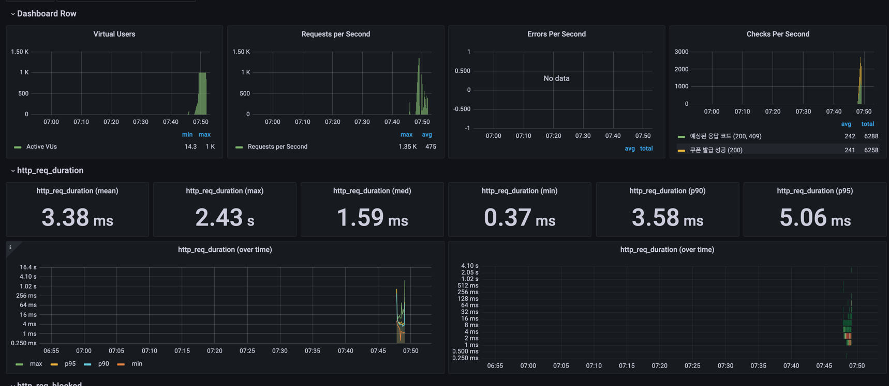
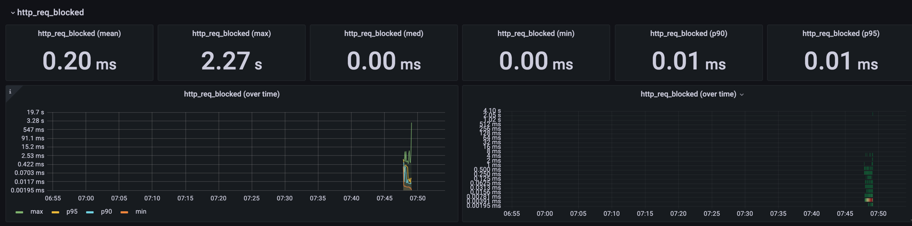
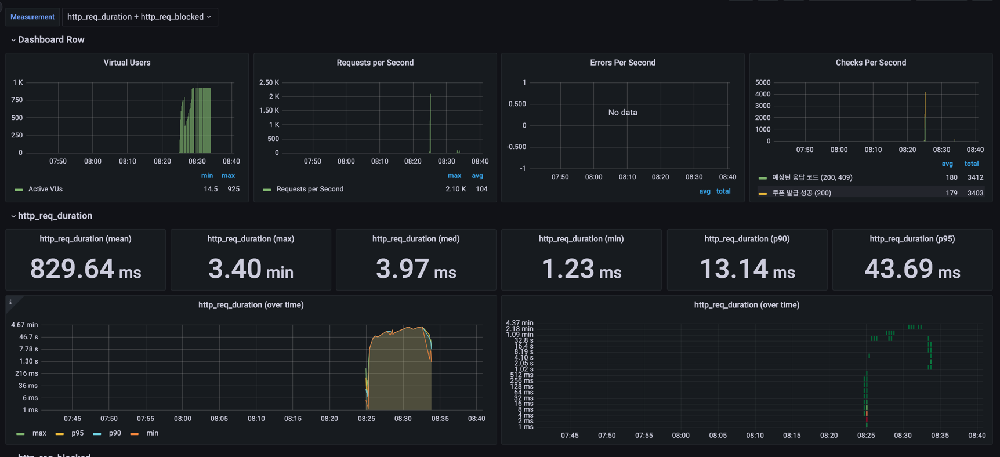
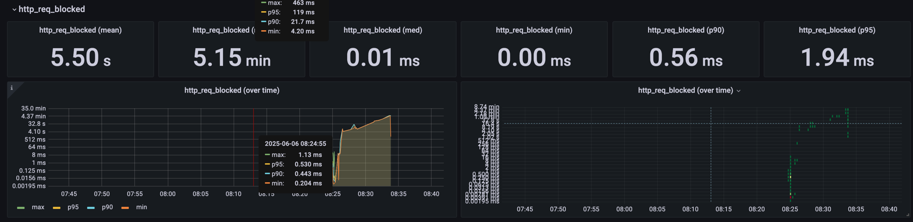

# 🟣 성능 테스트 결과 보고서
 

## 1. 결론 요약
이번 부하 테스트는 Redis + Kafka 기반 선착순 쿠폰 발급 시스템에 대해 
1,000 VU 및 2,000 VU 환경에서의 동시 접속 및 트래픽 집중 상황을 시뮬레이션하여 
성능 임계점과 병목 발생 지점을 확인하는 것을 목적으로 진행하였습니다.  

1,000 VU 테스트에서는 응답 시간(P95: 5ms), 성공률(99.5% 이상), 에러율(0%) 측면에서 비교적 안정적인 결과를 보여 
현재 시스템이 해당 수준까지는 정상적으로 처리 가능함을 확인할 수 있었습니다. 

  

---

## 2. 테스트 결과

### 🟡 VUs: 1,000 기준

 

| 항목                            | 값           | 해석                                                       |
| ----------------------------- | ----------- | -------------------------------------------------------- |
| **Max VUs**                   | 1,000       | 설정한 1,000 VU에 도달함. 시스템이 해당 수준의 부하는 수용 가능한 것으로 보임         |
| **Requests per Second (max)** | 1,350 req/s | 순간 TPS는 높았으며, sleep(1\~3초) 영향으로 평균 475 req/s 수준에서 분산 처리됨 |
| **Mean 응답 시간**                | 3.38ms      | 평균 응답 시간은 낮은 편이며, 테스트 중 병목 현상은 관찰되지 않음                   |
| **P95 응답 시간**                 | 5.06ms      | 95%의 요청이 5ms 이내에 처리됨                                     |
| **Max 응답 시간**                 | 2.43초       | 일부 요청에서 지연 발생. 큐 대기로 인한 가능성이 있으며 평균값 대비 큰 편은 아님          |
| **Error 수**                   | 0 (표면상 없음)  | HTTP 5xx 오류는 발생하지 않았음. 테스트 중 에러 응답은 확인되지 않음              |
| **Checks per Second**         | 평균 242회     | 총 6,288건 중 6,258건 성공. 약 99.5% 수준의 응답 성공률을 기록함            |

 

### 🧩 시스템 응답 특성 요약
- 트래픽이 sleep 구간을 통해 분산되면서 단일 서버에 급격한 부하가 집중되지는 않았음
- 평균 응답 시간은 약 3ms, P95 기준 5ms로 대부분의 요청이 빠르게 처리됨
- 소수의 요청에서는 최대 2.4초 수준의 지연이 관찰되었으며, 이는 큐 대기 또는 일시적 처리 지연으로 해석 가능
- 전체 요청 중 오류 응답은 없었으며, 요청 성공률은 약 99.5%로 측정됨
- 테스트 구간 동안 CPU, 메모리 등의 리소스 사용률은 과도하게 상승하지 않았고, 시스템은 안정적인 상태를 유지함

  

---

### 🟡 VUs: 2,000 기준

| 항목                            | 값                   | 해석                                                             |
| ----------------------------- | ------------------- | -------------------------------------------------------------- |
| **Max VUs**                   | 2,000               | 설정한 최대 VU 수치까지 도달했으나, 처리 성능 면에서 병목이 발생함                        |
| **Requests per Second (max)** | 355 req/s           | 초당 처리 요청 수는 일정 수준을 유지했으나, 높은 실패율로 인해 실질 처리량은 제한적임              |
| **Mean 응답 시간**                | 46.89ms             | 평균 응답 시간은 짧지만, 성공한 요청 기준으로 산정된 수치임에 유의해야 함                     |
| **P95 응답 시간**                 | 9.14ms              | 성공 요청 중 95%가 해당 시간 내에 응답되었으며, 실패 요청이 많아 전체 성능을 대표하긴 어려움        |
| **Max 응답 시간**                 | 13.2초               | 일부 요청에서 13초 이상의 지연 발생. 큐 적체 또는 응답 지연 가능성이 있음                   |
| **Error 수 / 실패율**             | 11,254건 / 64.11% 실패 | 전체 요청 중 약 64%가 실패하였으며, connection timeout 및 요청 거절이 주요 원인으로 추정됨 |
| **Dropped Iterations**        | 251,771건            | 처리되지 못한 요청이 누락되며 발생한 수치. 시스템 처리량 한계를 보여주는 지표임                  |
| **Checks 성공률**                | 24.07%              | 유효 응답(200 또는 409)을 받은 비율은 약 24%로, 전체 요청 중 성공 응답은 제한적이었음        |

 

### 🧩 시스템 응답 특성 요약

- 2,000 VU 부하 조건에서는 시스템 처리 한계가 관찰되었으며, 요청 실패율이 64%에 달함
- connection refused, timeout, dropped iteration 등의 현상이 반복적으로 발생
- TPS는 일정 수준 유지되었으나, 성공한 요청의 절대량이 부족해 정상적인 서비스 제공은 어려운 수준으로 판단됨
- 주요 병목 요인으로는 다음과 같은 가능성이 고려됨
  - 애플리케이션 처리량 한계
  - DB 커넥션 풀 제약
  - 네트워크 또는 I/O 자원 병목

  

---

## 3. 결론 및 대응 방안

- 1,000 VU 수준까지는 비교적 안정적으로 서비스 제공 가능함을 확인
-2,000 VU 이상의 트래픽에서는 시스템 처리 성능의 한계가 관찰됨
- 리소스 확장 또는 구조 개선 없이는 대규모 이벤트 대응이 어려운 상황으로 판단됨

 

### 3-2. 트래픽 대응을 위한 확장 전략

#### 📍 서버 수평 확장

동시 접속자 수 증가에 대비하기 위해 서버를 수평 확장(horizontal scaling)하는 방식이 유효합니다.   
예를 들어 단일 서버 기준 약 1,500 VU를 처리할 수 있는 것으로 가정하면  
5,000 VU 수준의 트래픽을 감당하려면 최소 4대 이상의 서버가 필요합니다.   
이렇게 하면 각 서버에 분산된 트래픽을 통해 부하 집중을 완화할 수 있습니다. 

 

#### 📍 로드 밸런싱 도입

로드 밸런서를 구성하여 사용자 요청을 여러 서버에 균등하게 분배함으로써  
단일 서버 과부하를 방지하고 전체 시스템의 안정성을 높일 수 있습니다.   

---
